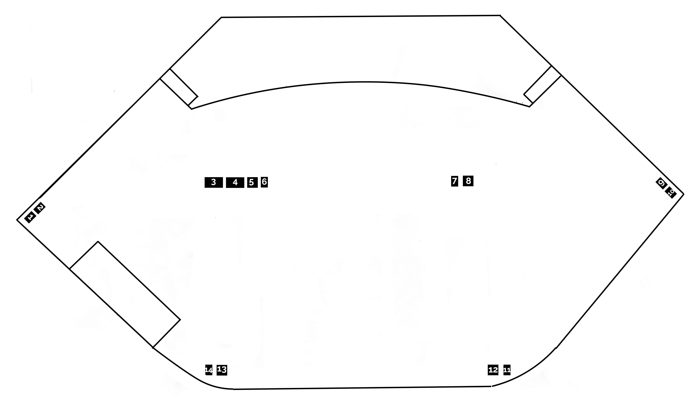

```{r setup}
source("commonPackages.R")
```

```{r functions}
source("commonFunctions.R")
source("commonFunctionsAudio.R")
source("commonCrosspoint.R")

```

```{r getdata}
db.network <- get.network()
db.assets   <- get.assets() #Assets are cached via commonFunctions.R

dlive <- c("2407-3000", "2407-3001", "2407-3002", "2410-1902")

```

```{r dci}
dlive_devices <- c("2407-3000", "2407-3001", "2407-3002", "2410-1902")

dante.console.ins <- db.cables |>
	filter(Protocol == "dante", DstTag %in% dlive_devices, !is.na(Usage)) |>
	left_join(db.assets |> select(AssetTag, Model, Desc), by = c("SrcTag" = "AssetTag")) |>
	mutate(Source = paste(SrcTag, coalesce(Model, ""), coalesce(Desc, ""))) |>
	select(Source, SrcPort, DstTag, DstPort, Usage) |>
	arrange(DstTag, DstPort)
```

# Introduction

This document provides key technical documentation for the main auditorium audio subsystem at UAC. Other audio systems are not documented to this level of detail (Youth, Children).

Purpose:

* Necessary to help the hearing impaired ( roughly 10% of the population) 
* Supports video recording and streaming
* For music, creates a pleasing blend of all the instruments and vocals
* Helps audience to focus and concentrate
* Reinforces the message (spoken or sung)

# Configuration

The descriptions of the configurations will generally start at the input side of the system and work towards the outputs. The connecting lines are illustrative not specific. Some of those lines are implemented as analog connections, some are GigaAce, and some as Dante.

```{dot overview.foh}
//| label: fig-audio-foh-overview
//| fig-cap: "Audio system overview."
//| file: gv/sda-overview.gv
``` 

```{dot overview.video}
//| label: fig-audio-video-overview
//| fig-cap: "Audio Video overview."
//| file: gv/sda-audio-video-overview.gv
``` 
 
## Inputs

There are a variety of microphone inputs that come from the stage. 52 from the floor pockets, and an additional 16 via a stagebox.

In the balcony, there are analog inputs for the talkback mic, reference mic, the CD player, as well as a *guest* input for a laptop or media player (1/8").

There are also 128 Dante inputs available. Those are used for the Shure Wireless Mics, the feed from ProPresenter and from the Livestream DAW.

The mixer consists of three components: The mix surface in the balcony, a 16-input stagebox on the drum riser, and the main mix engine (called a MixRack) located in the amp rack. These three components are linked together via an STP cable.

The console system has preamp inputs via the stage box, the mixrack and the surface itself. It also accepts inputs via a Dante card installed in the mixrack.

```{dot sda-inputs-dlive-a}
//| label: fig-sda-inputs-dlive-analog
//| fig-cap: "dLive Analog Inputs"
//| file: gv/sda-inputs-dlive-analog.gv
``` 

```{dot sda-inputs-dlive-d}
//| label: fig-sda-inputs-dlive-dante
//| fig-cap: "dLive Dante Inputs"
//| file: gv/sda-inputs-dlive-dante.gv
``` 

### dLive Input Assignments

A consistent wiring plan helps make system more predictable and easier for all audio engineers to use. The consistent wiring plan is also essential to leverage the power of the console's show and scene recall feature. It minimizes the amount of rewiring required. 

The dLive system is capable of mixing 128 inputs at a time. We are configured with considerably more input capacity which gives a lot of flexibility. The socket details for each dLive device are listed in the tables below.

```{r in-count}
ic <- tribble(~Device, ~`Input Count`,
  'DM 64 Mixrack', 64
, 'Surface',       8
, 'DX168',         16
, 'Dante',         128
			  )

ic |>
	arrange(desc(`Input Count`)) |>
	gt() |>
	opt_stylize(style=5) |>
	grand_summary_rows(
    	columns = `Input Count`,
    	fns = list(fn = "sum"  
    			    	, label =   "Total" 
    			   ),
    formatter = fmt_number,
    	decimals = 0
  ) |>
  tab_options(
    grand_summary_row.background.color = "lightgrey",
    stub.background.color = "white" 
  ) |>
	tab_header("Input Count per Device")
```

```{r input.overview}
tribble(~Device, ~InputRange, ~Notes
, "MixRack", "01-64", "Floor Boxes 03, 04, 12, 13, 01"
, "DX168", "65-80 Intended", "Actual 1-12 & 17 (NEED To FIX)"
, "Dante ULXD", "81-96", "Dante 1-16"
, "Dante Other", "97-120", "Dante 17-40. Dante Inputs 41-128 not available"
, "S5000", "121-128" ,"Rear of Surface"
		) |>
	gt() |>
	opt_stylize(style=5) |>
	tab_header("Input Overview")

```
 
 
 
```{r}
db.cables |>
	filter(DstTag %in% dlive) |>
	arrange(DstTag, DstPort) |>
	select(DstTag, DstPort, Usage, SrcTag, SrcPort) |>
	filter(!is.na(Usage)) |>
	group_by(DstTag) |>
	group_split() |>
	purrr::walk(\(grp) {
		grp |>
			gt() |>
			opt_stylize(style = 5) |>
			tab_header(  glue( "Asset: {unique(grp$DstTag)}"  ) ) |>
			print()
	})
```

```{r top1}
print_inv(c( "2407-3000", "2407-3001", "2407-3002", "2410-1902",
			 "CUMU-G002", "ZAPU-0001",
             "ZAMU-A001", "ZAMU-B001", "ZAMU-B002", "ZAMU-B003"
               
             ), db.assets)
```

## Front of House

### Consoles

Recalling
Show "Master"
Scene "Master"
     is an excellent foundation for 95% of the services we run in a year. 
 
After the console, some audio processing is handled by the Q-sys core, and some directly by the amplifiers.

### Outputs
 
```{dot fig-sda-mains}
//| label: fig-sda-mains
//| fig-cap: "Outputs - Mains"
//| file: gv/sda-outputs-mains.gv
```

```{dot fig-sda-monitor}
//| label: fig-sda-monitor
//| fig-cap: "Outputs- Monitors"
//| file: gv/sda-outputs-monitors.gv
```

```{dot fig-sda-video}
//| label: fig-sda-video
//| fig-cap: "Outputs- Video"
//| file: gv/sda-outputs-video.gv
```

```{r foh-inv}
#| label: tbl-foh-inv
#| tbl-cap: FoH Inventory
cs <- c( 
"2407-3001",
"ZAHU-0001", "ZAHU-0005", "ZAHU-0002", "ZAHU-0001", "ZAHU-0006",
"ZVKU-A003", "ZAIU-E001")

print_inv(cs , db.assets) |> tab_header("Front of House Inventory")
```

### Other FoH gear

These can all be found in the table above, @tbl-foh-inv.
 
#### Lobby Speakers

The lobby speakers are driven from an AVIO adapter which normally has audio routed to it from a matrix output on the mixrack via Dante.

The lobby distribution is handled via a Stuart Audio Hub. It drives four 10W amplifiers which are mounted on the speakers in the lobby ceiling. Signal and power distribution is via Cat5 cable (which is __not__ ethernet). 


```{dot fig-sda-lobby}
//| label: fig-sda-lobby
//| fig-cap: "Lobby Audio"
//| file: gv/sda-lobby.gv
```
 
#### Inventory details for this section

```{r lobby.inv}
cs <- c("2410-0800", "2410-0803", "ZAAU-0009", "ZAAU-0010")

print_inv(cs , db.assets)
```

### Outputs 

```{r}
db.cables |>
	filter(SrcTag %in% dlive) |>
	arrange(SrcTag, SrcPort) |>
	select(SrcTag, SrcPort, Usage, DstTag, DstPort) |>
	filter(!is.na(Usage)) |>
	group_by(SrcTag) |>
	group_split() |>
	purrr::walk(\(grp) {
		grp |>
			gt() |>
			opt_stylize(style = 5) |>
			tab_header(  glue( "Asset: {unique(grp$SrcTag)}"  ) ) |>
			print()
	})
```

## Amplifiers

Now lets finish our journey to the speakers.  

* Amps 1 - 6 drive the front clusters. Clusters are numbered from East to West.
* Amp 7 is the under balcony.
* Amps 8 - 9 drive the monitors. 

```{r}
fohamp.list <- c( "Amp1", "Amp2", "Amp3" 
             , "Amp4", "Amp5", "Amp6"
			 , "Amp7" )

monamp.list <-  c( "Amp8-Mon1-4", "Amp9-Mon5-8")

amp.list <- c(fohamp.list, monamp.list)
```

```{r}
crosspoint(db.cables
		   ,  source_assets="2408-2700" 
		   , dest_assets=fohamp.list)
```

```{dot sda-outputs}
//| label: fig-sda-outputs
//| fig-cap: "Outputs"
//| file: gv/sda-outputs.gv
```

```{r  }
#| label: tab-amp-list
#| tab-cap: List of Amplifiers
#| tbl-cap-location: bottom

print_inv(amp.list, db.assets)
```


```{r bose.amps}

ba <- tribble(
~AssetTag, ~Ch1Job, ~Ch2Job, ~Ch3Job, ~Ch4Job,
"Amp1" , "1-Bot" ,"1-Top", "unsure", "unsure",
"Amp2" , "" ,"", "", "",
"Amp3" , "" ,"", "", "",
"Amp4" , "" ,"", "", "",
"Amp5" , "" ,"", "", "",
"Amp6" , "Sub" ,"", "6-Bot", "6-Mid",
"Amp7" , "UBal East" ,"UBal Centre", "UBal West", ""
)

```


```{r gt.ba}
ba |> 
	gt() |>
	opt_stylize(style=5) |>
	tab_header("Bose Amp Channel Usage") |>
	tab_footnote("The channel usage is not fully documented. This is a work in progress.")

```

## Speakers

We have speakers in several locations:

* Main cluster for Front of House which is suspended in front of the stage.
* Monitor speakers on the stage floor
* FoH fill speakers underneath the balcony
* in the lobby ceiling

The monitors speakers should be wired for __at most__ two speakers per channel (amp). 

```{r}
cs <- c("ZASU-0001-0002",
"ZASU-0003-0005",
"ZASU-0006-0011",
"ZASU-0012-0019",
"ZASU-0020-0021")

print_inv(cs , db.assets)
```


# Stage Plot

```{r, fbs}
fbs <- tribble(~Size, ~Width, ~Height,
  "Small",  18, 27
, "Medium", 27, 27
, "Large",  47, 27
			   )

fbs |> 
	gt() |>
	opt_stylize(style=5) |>
	tab_header("Floor Pocket Sizes", subtitle="Centimeters")
```



```{r stageplot}
pockets <- tribble(~PocketNum, ~Size, ~Usage
, 01, "S", "Inputs 49-54"
, 02, "S", "Power Breaker 20B"
, 03, "L", "Inputs 1-24"
, 04, "L", "Inputs 25-40"
, 05, "M", "Monitors 1-6"
, 06, "S", "Power Breaker 14B"
, 07, "S", "Power Breaker 13B"
, 08, "M", "Monitor 1-6 & DMX"
, 09, "S", "Empty"
, 10, "S", "Power Breaker 19B"
, 11, "S", "Power Breaker 13A"
, 12, "M", "Inputs 45-48"
, 13, "M", "Inputs 41-44"
, 14, "S", "Power Breaker 14A"
				   )

pockets |> 
	gt() |>
	opt_stylize(style=5) |>
	tab_header("Floor Pocket" )
```

```{r}
db.assets |> filter(str_detect(AssetTag, "^FB")) |>
	select(AssetTag, Model, Usage) |> 
	gt() |>
	opt_stylize(style=5) |>
	tab_header("Floor Pocket" )
```


# Dante Configuration

Dante enables certain audio devices to route audio signals using standard network technologies. Routing is managed via software provided by Audinate called "Dante Controller".  

Several audio devices are Dante capable, including both mixers, the Shure wireless microphones and the computers.

The Q-Sys Core (2408-2700) is set as the preferred Dante master clock. **The system clock is set to 48kHz.**

As well as the controller software there are two other software titles that provide the capabilities. 

Dante Virtual Soundcard
: This title is licensed for all three computers and enables the computer to send and receive multiple channels of audio over the network as if it were attached via a traditional sound card.
 
Dante VIA
: This title is also licensed for all three computers. It enables the routing of audio for specific applications within the computer and also within the Dante network.

Dante Controller
: This is free software. It is used to manage the Dante network and provides virtual patchbay capabilities to link sources (transmitters) and sinks (receivers).

Visit [https://www.audinate.com](https://www.audinate.com) to learn more about Dante. Audinate have a very good certification series of videos on YouTube.

## Dante Network Topology
This is the network topology, @fig-sda-dante. The patching between inputs and output is managed by *Dante Controller*  software on a computer. *Dante Controller* does not need to be running for the Dante network to function, just to make patch changes. See the charts of below for the inputs and outputs.

```{dot sda-dante}
//| label: fig-sda-dante
//| fig-cap: "Dante Network"
//| file: gv/sda-dante.gv
```

```{r func_fmt_dante_chart}
fmt_dante_chart <- function(dir, targets, header) {
	tab <- get_dante_devices() |>
	filter(InOut == dir) |>
	filter(Device %in% targets) |>	
	filter(Used == "Y") |>
 	left_join(db.assets, by=join_by(Device == AssetTag)) |>
	mutate(GroupTitle = paste(Device, Model, Desc)) |>
#todo figure out why USage isn't in the data
		
	#select(GroupTitle, NetworkDevice, NetworkDeviceChannel, Label, Usage) |>

			select(GroupTitle, NetworkDevice, NetworkDeviceChannel, Label) |>
	gt(groupname_col = "GroupTitle") |>
	opt_stylize(style=3) |>
	tab_header(header) |>
	cols_label(NetworkDeviceChannel = "Ch")  |>
  tab_options(     # these does not work well for pdf output :( 
      row_group.as_column = FALSE
    , row_group.font.weight = 'Bold'  
    , row_group.font.size = 12
    , table.font.size = 8
  )	
	
  return(tab)	
}

```

## Dante Inputs by Device

Each row shows a Dante audio path arriving at a receiving device (`DstTag`).

```{r dante-inputs-by-device}
db.cables |>
	filter(Protocol == "dante", !is.na(Usage)) |>
	left_join(db.assets |> select(AssetTag, Model, Desc), by = c("DstTag" = "AssetTag")) |>
	mutate(Device = paste(DstTag, coalesce(Model, ""), coalesce(Desc, "")) |> str_squish()) |>
	select(Device, DstPort, SrcTag, SrcPort, Usage) |>
	arrange(Device, DstPort) |>
	group_by(Device) |>
	group_split() |>
	purrr::walk(\(grp) {
		grp |>
			select(-Device) |>
			gt() |>
			opt_stylize(style = 3) |>
			tab_header(unique(grp$Device)) |>
			print()
	})
```

## Dante Outputs by Device

Each row shows a Dante audio path leaving a transmitting device (`SrcTag`).

```{r dante-outputs-by-device}
db.cables |>
	filter(Protocol == "dante", !is.na(Usage)) |>
	left_join(db.assets |> select(AssetTag, Model, Desc), by = c("SrcTag" = "AssetTag")) |>
	mutate(Device = paste(SrcTag, coalesce(Model, ""), coalesce(Desc, "")) |> str_squish()) |>
	select(Device, SrcPort, DstTag, DstPort, Usage) |>
	arrange(Device, SrcPort) |>
	group_by(Device) |>
	group_split() |>
	purrr::walk(\(grp) {
		grp |>
			select(-Device) |>
			gt() |>
			opt_stylize(style = 3) |>
			tab_header(unique(grp$Device)) |>
			print()
	})
```


  


```{r dante_inv}
#| label: tbl-dante-inventory
#| tbl-cap: Dante Inventory
#| 
cs <- c(  "ZAIU-B001", "ZAIU-B002" 
        , "ZAMU-A001", "ZAMU-B001", "ZAMU-B002", "ZAMU-B003"
        , "NSCU-A003", "NSCU-A004"
        , "CDWU-0009", "CDMU-A001"
        , "ZAIU-E001", "ZAIU-E002"
		, "CUMU-G001", "CUMU-E001"
		, "2308-1124"
        )

print_inv(cs , db.assets)
```

# LiveStream Configuration

The Livestream audio can be fed from three different sources. The choice is made on the Q-Sys touch panel (2408-2704) under **Video Send** - see the *Video Mix* section of the Operations document.

#. **Mains** - the Front of House main outputs. This is best used for simple events like most funerals and weddings. The Livestream audio is a direct copy of the main house audio.
#. **Matrix** - the "2Video" matrix output from the console. This is used for more complex audio events when we don't have a broadcast engineer at the DAW. The Front of House engineer can do a mix from the surface.
#. **DAW** - the output of Reaper. This option is used for most Sundays when the DAW is manned.

All three sources arrive at the Q-Sys Core (2408-2700) via Dante. The Core routes the selected pair to a Dante-to-analog adapter (avio 2308-1124) which feeds the XLR audio inputs of the ATEM 2ME video mixer (2601-2800). See @fig-sda-livestream-overview.

```{dot livestream}
//| label: fig-sda-livestream-overview
//| fig-cap: "Livestream Overview"
//| file: gv/sda-livestream-overview.gv
```

## Dante Routing

The routes that carry the livestream audio are listed in @tbl-livestream-routes. This table is generated from the cabling database.

```{r livestream-routes}
#| label: tbl-livestream-routes
#| tbl-cap: Livestream Audio Routes
db.cables |>
	filter( (DstTag == "2408-2700" & DstPort %in% sprintf("%02d", 1:7))
		  | (SrcTag == "2408-2700" & DstTag == "2308-1124")
		  | (SrcTag == "2308-1124" & DstTag == "2601-2800") ) |>
	arrange(DstTag, DstPort) |>
	select(SrcTag, SrcPort, DstTag, DstPort, Type, Usage) |>
	gt() |>
	opt_stylize(style=3) |>
	sub_missing(missing_text = "-")
```

## DAW Source (Reaper)

* Reaper runs on CUMU-E001 using Dante Virtual Soundcard (DVS) in 64x64 mode.
* The dLive sends the direct outs of the input channels (after gain, before trim) to Reaper via Dante. The Shure wireless microphones come into the dLive preamps like every other input and reach Reaper the same way. See the dLive Dante outputs in the Operations document for the channel map.
* Reaper is configured to use Dante for both input and output.
* Reaper sends its stream mix (L/R) back to the Q-Sys Core on Dante inputs 6 and 7.

## Backup: Mixing from the Surface

If there is a problem with the Reaper computer, or the event is short staffed and the livestream needs to be mixed by FoH, select **Matrix** (or **Mains**) on the touch panel. No Dante Controller changes are needed; the Core does the switching.

## Fallback to Analog

If the Dante path to the video mixer fails entirely, DM64 analog outputs 31 and 32 (amp rack) carry a copy of the main Left and Right. Run those by XLR directly to the ATEM audio inputs, bypassing the avio adapter. Audio levels in the video mixer will need to be checked and adjusted; this can be done on the panel interface or via the ATEM control software, Audio section.

# Network Details
Some of the audio system components have network (tcp/ip specifically) connectivity requirements. The primary audio console can be remotely operated from an iPad, so other devices also must be on the network as well, but they are personal devices and not part of this inventory. In the balcony, network switch NSCU-A003 provides wired access.    

```{r ni716} 
#TODO: redo using the new network data structure

 # db.network %>% 
 #  filter(Category=="Audio") %>% 
 #  select(AssetTag, Usage, Device, MAC, IP, URL, Notes) %>%
 #  kable()  
    # kable_styling("striped", full_width = TRUE)
```

 

# Equipment Inventory

```{r inventory, echo=FALSE, asis=TRUE}

cs = c("AssetTag", "Qty"  ,
  "Manufacturer" ,
  "Model"  , 
  "Qty",
  "Location"  ,
  "Type" ,
  "Desc"     )

db.assets %>%  
          filter( Category=="Audio" , InService== "Y") %>%  
          dplyr::select(one_of(cs)) %>% 
          kable(   )   
    # kable_styling("striped", full_width = TRUE)
```


## Terminology

```{r}
# A hack - gt doesn't provide a means of line-breaking for pdf. So we create a graphic and then include the graphic.

tab <- get.glossary() |>
	filter(Topic == "Audio" | Topic == "General") |>
	select(Term, Definition, Topic) |>
	arrange(Topic, Term) |>
    gt(groupname_col = "Topic") |>
	opt_stylize(style=3) |>
	fmt_markdown(columns=Definition) |>
	tab_style(
  style = cell_text(weight = "bold", size="large"),
  locations = cells_row_groups()
)
```

```{r glossary, results='asis'}
cat(print_gt_table(tab))
``` 



# Input Map for Printing

 

The DM64 analog inputs and the floor box socket that feeds each one, generated from the cabling database. Intended as a tear-off sheet for the stage.

```{r input-map-printable}
#| label: tbl-dm64-input-map
#| tbl-cap: DM64 Analog Input Map
inmap <- get_inputs("2407-3000") |>
	filter(str_detect(DstPort, "^in_\\d+$")) |>
	mutate(Socket = readr::parse_number(DstPort)) |>
	filter(Socket <= 64) |>
	select(Socket, Box = SrcTag, Usage) |>
	right_join(tibble(Socket = 1:64), by = "Socket") |>
	arrange(Socket)

left  <- inmap |> filter(Socket <= 32)
right <- inmap |> filter(Socket >  32) |> rename_with(~ paste0(.x, "_B"))

bind_cols(left, right) |>
	gt() |>
	opt_stylize(style = 3) |>
	sub_missing(missing_text = "") |>
	cols_label(Socket_B = "Socket", Box_B = "Box", Usage_B = "Usage") |>
	tab_style(
		style = cell_borders(sides = "left", color = "black", weight = px(3)),
		locations = cells_body(columns = "Socket_B")
	) |>
	tab_style(style = cell_text(weight = "bold"),
			  locations = cells_body(columns = c("Socket", "Socket_B")))
```
