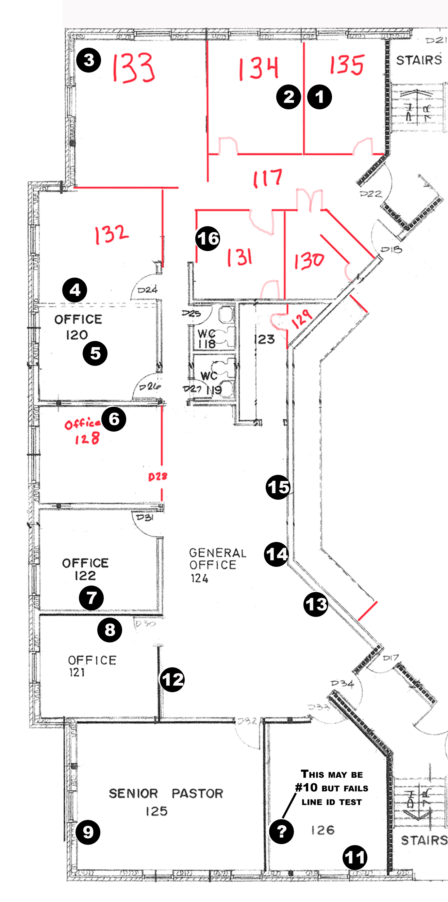

```{r functions}
source("commonPackages.R")
source("commonFunctions.R")
source("commonDiagram.R")

portmap <- function(sw) {
 cap <- glue("Port Usage for {sw}")

 t<- cables |>
	filter(SrcTag == sw  ) |>
 	mutate(Comments = paste(Usage, Notes)) |>
	select(  Tag
		   , SrcPort
		   , DstTag
		   , DstPort
		   , Type
		   , Length
		   , Comments) |>
 	arrange(SrcPort) |>
	gt() |>
	opt_stylize(style=3) |>
	tab_header(cap) |>
	cols_label( Tag = "Label")
 
 return(t)
}
```

```{r getdata}
network <- get.network()
inventory <- get.inventory()
cables <- get.cables()
```

# Introduction

This document provides key technical documentation for the Network subsystems at UAC that are relevant to the AV system.

The network is used for these purposes:

1.  Production Management - specifically use of services like OneDrive, Planning Centre Online, Song Select, YouTube and the church website.
2.  Pre/Post Service Content Distribution - Pre service is typically handled via OneDrive services. Post Service consists of uploads of audio to the church website and the service recording to YouTube
3.  Device Control - many devices depend on the network for operational controls. Examples: the projectors, cameras, recorders.
4.  LiveStreming via Resi **Bandwidth Critical**
5.  Audio media stremaing via Dante **Bandwidth Critical**
6.  Video media stremaing via NDI and RTSP **Bandwidth Critical**

There are content filtering rules applied to the network which blocks access to sites which are contrary to church policies. These rules should not cause any operational problems. If connection challenges arise it is good to know that they are in place.

# Overview of Network Topology

There are two interconnected physical networks. The general network 192.168.0.0/24 and the AV Network.

::: callout-note
There are likely more networks than depcited here. Which have not yet been documented.
:::

The purpose of the AV Network is to isolate the Dante traffic to its own physical devices to both tightly control bandwidth and access. The AV Network is itself divided into two VLANs:

```{r av.vlan}
tribble(~NAME, ~VLAN, ~Subnet, ~Description
, "AV Network", "2", "192.168.200.0/24", "AV Operations including Dante"
, "Default",    "1", "192.168.201.0/24", "AV Management - Network Devices"
, "Control",    "6", "192.168.206.0/24", "Control"
, "Klang",      "3", "192.168.203.0/24", "Klang IEM App"
, "Lighting",   "5", "192.168.205.0/24", "Lighting (sACN)"
, "NDI",        "4", "192.168.204.0/24", "NDI Video"
, "TVs",        "7", "192.168.207.0/24", "TV Control"
) |>
	arrange(VLAN) |>
	gt() |>
	opt_stylize(style=5)
```

# External Access Capabilities

There are four ways that the UAC network can be access from the general internet.

ScreenConnect

:   The remote access solutions provided by Neysh Systems. Selected on-premise computers can be access via the instance of **ScreenConnect**. See Dan/Terry for connection details.

TP-Link Omada Cloud

:   Omada Cloud can be used to access the AV network for network management purposes. Individual computers cannot be accessed via this channel. Access is currenlty provisioned to Terry and members of AVLI for support purposes.

Q-SYS Reflect

:   A Q-SYS Core provides the primary control for the AV system. On-premise there is a touch screen in the balcony that can turn the system on and off as well as provide control over someother options. The Core can be accessed remotely for support purposes, as well as remote deployment of system updates. THe user interface can also be access remotely to check status or change state. Access is managed via [Q-SYS Reflect](http:reflect.sys.com). Autorized users include Terry and select members of the AVLI team.

Rogers Network Management

:   Rogers has the ability to remote into their devices to check status and make changes. These Rogers devices operate in 'Bridge' mode. UAC church staff do not have this access.

# Protocols in Use

## Dante

Audinate’s Dante protocol uses a combination of network protocols for different purposes. Multicast is used an IGMP snooping is required. Clock stability is critical for this workload. Details:

1.  [**Addressing**: Dante devices use DHCP for addressing when available or will auto-assign an IP address in the 169.254.0.0/16 range on the primary network and 172.31.0.0/16 on the secondary network if DHCP is not available^1^](https://www.audinate.com/learning/technical-documentation/dante-information-for-network-administrators).

2.  **Audio Transport**: Dante audio is unicast by default but can be set to use multicast for cases of one-to-many distribution. [The ports used are UDP 14336-14591 for unicast and UDP 4321 for multicast^1^](https://www.audinate.com/learning/technical-documentation/dante-information-for-network-administrators).

3.  **Video Transport**: Dante video is optimized to run on Gigabit Ethernet and has a bandwidth cap of 700 Mbps. [Dante video flows must be multicast if video is being sent to more than one destination^1^](https://www.audinate.com/learning/technical-documentation/dante-information-for-network-administrators).

4.  [**Device Discovery**: mDNS and DNS-SD are used for discovery and enumeration of other Dante devices including Dante Controller^1^](https://www.audinate.com/learning/technical-documentation/dante-information-for-network-administrators).

5.  [**Synchronization**: Dante uses Precision Time Protocol (PTP version 1, IEEE 1588-2002) by default for time synchronization^1^](https://www.audinate.com/learning/technical-documentation/dante-information-for-network-administrators).

6.  **Control and Monitoring Traffic**: Dante monitoring and control traffic uses various ports. [For example, UDP 8700-8708 for multicast control and monitoring, and UDP 4440, 4444, 4455 for audio control^1^](https://www.audinate.com/learning/technical-documentation/dante-information-for-network-administrators).

7.  **Quality of Service (QoS)**: Dante as a real-time media streaming service benefits from low latency and jitter on the network. [QoS should be used for prioritization of Dante clock and audio on mixed-use networks^1^](https://www.audinate.com/learning/technical-documentation/dante-information-for-network-administrators).

## NDI

NewTek’s Network Device Interface (NDI) uses a combination of network protocols for different purposes:

1.  [**Addressing**: NDI resolves host names to IP addresses over the LAN automatically^1^](https://ndi.tv/tools/education/networking/best-practices/networking-best-practice/). [It uses mDNS (multicast Domain Name System) to create a zero-configuration environment for discovery^1^](https://ndi.tv/tools/education/networking/best-practices/networking-best-practice/).

2.  [**Video and Audio Transport**: NDI is designed to run over gigabit Ethernet^2^](https://en.wikipedia.org/wiki/Network_Device_Interface). [It operates bi-directionally over a LAN with many video streams on a shared connection^1^](https://ndi.tv/tools/education/networking/best-practices/networking-best-practice/). [Its encoding algorithm is resolution and frame-rate independent, supporting 4K resolutions and beyond along with 16 channels and more of floating-point audio^1^](https://ndi.tv/tools/education/networking/best-practices/networking-best-practice/).

3.  [**Discovery and Registration**: NDI uses mDNS for automatic discovery and registration^1^](https://ndi.tv/tools/education/networking/best-practices/networking-best-practice/). [It also supports 2 other discovery modes (NDI Access, NDI Discovery Server) that allow for operations across subnets and without mDNS^2^](https://en.wikipedia.org/wiki/Network_Device_Interface).

4.  [**Transport Protocols**: NDI uses TCP by default^2^](https://en.wikipedia.org/wiki/Network_Device_Interface). [NDI 3.x has options to use UDP multicast or unicast with forward error correction (FEC) instead of TCP, and can load balance streams across multiple network interface controllers (NICs) without using link aggregation^2^](https://en.wikipedia.org/wiki/Network_Device_Interface). [The release of NDI version 4.0 introduces the ‘Multi-TCP’ transport^2^](https://en.wikipedia.org/wiki/Network_Device_Interface).

# ISP Service

```{dot isp_service}
//| label: fig-isp_service
//| fig-cap: "ISP Service"
//| file: gv/sdn-isp-service.gv
```

# Overall Switch Topology

```{dot overalltopology}
//| label: fig-overalltopology
//| fig-cap: "Overall Switch Topology"
//| file: gv/sdn-overalltopology.gv
```

::: callout-note
The A&H dLive Mixrack (2407-3000) has a closed network connection to the S5000 mix surface (2407-3001) via a black STP cable from Room130 to Room205. The MACs for both devices should show up on the same port on the switch. The ethernet port on the s5000 surface should not be used.
:::

```{r gt.switch_inv }
selected.at <-   
  		   	c( "NSCU-A001"
  		   	 , "NSCU-A002"
  		   	 , "NSCU-A003"
  		   	 , "NSCU-A004"
  		   	 , "NSCU-A005"
  		   	 , "2308-1100"
  		   	 , "NSTU-H001"
                   )

 network |>
 	filter( AssetTag %in% selected.at) |> 
    select(AssetTag, Device, Usage, MAC, IP, Notes) |>
 	arrange(AssetTag) |>
	gt() |> 
	tab_header("Switch Inventory - MACs and IP") |>
    opt_stylize(style=3) 
 
 inventory |> 
	filter( AssetTag %in% selected.at) |> 
 	select(AssetTag, Manufacturer
 		   , Model
 		   , Building
 		   , Floor
 		   , Room
 		   , Location
 		   , Desc) |>
 	arrange(AssetTag) |>
 	gt() |> 
	tab_header("Switch Inventory") |>
    opt_stylize(style=3) 
```

# Wifi

From an AV Technical Production perspective, our Wifi network is not normally used for media transport, but rather for control functions. Examples include:

-   Audiante Dante Controller
-   Shure Wireless Workbench
-   Renewed Vision Propresenter Remote
-   Yamaha Studio Manager
-   ETC Web control / Lighting Console
-   etc

We have used them for NDI video trnasport from cell phone to a production computer.

There is a network of nine wireless access points distributed around the building (Hewlett Packard Enterprise IAP-315). There is also a WAP in the Youth building.

```{r gt_wap_list}
inventory |>
	filter(Manufacturer == "Aruba") |>
	select(AssetTag, Manufacturer, Model, Building, Floor, Room, SN, Desc) |>
	arrange(AssetTag) |>
	gt() |>
	tab_header("Wifi SSID Inventory") |>
    opt_stylize(style=3) |>
	tab_header("WAP Inventory")
```

These WAPs support three SSIDs, each of which has specific purpose:

```{r SSIDS}
ssid <- tribble(
  ~SSID, ~Usage, ~Access, ~Bandwidth, ~MAC_Registration, ~Filtering,
"UAC",
"General Public",
"Internet Only",
"Lowest",
"Not Required",
"L03",

"UAC-SD",
"Staff Devices",
"Internet Only",
"Medium",
"Required",
"L02" ,

"UAC-SR",
"Church Devices",
"Internet and Internal",
"Unrestricted",
"Required",
"L01"
)

ssid |>
	gt() |>
	tab_header("Wifi SSID Inventory") |>
    opt_stylize(style=3) 
```

> Only UAC-SR has access to internal network devices. In order to control any systems or stream media to a production computer over the wifi network, the device would need to be on the UAC-SR network.

# Server Room

```{r sr_portmap}
portmap( "NSCU-A001")
```



# AV Rack Room

Cables in ports that need identification:

-   port 4 Grey
-   port 5 Black
-   port 6 Black
-   port 26 is the link for A001 ?? or A003

```{dot top-audiorack}
//| label: fig-top-audiorack
//| fig-cap: "Audio Rack Topology"
//| file: gv/sdn-top-audiorack.gv
```

```{r}
sw <- c("NSCU-A005")
cap <- glue("Location for {sw} ")

inventory |> 
	filter( AssetTag %in% sw) |> 
 	select(AssetTag, Manufacturer
 		   , Model
 		   , Building
 		   , Floor
 		   , Room
 		   , Location
 		   , Desc) |>
 	arrange(AssetTag) |>
 	gt() |> 
	tab_header(cap) |>
    opt_stylize(style=3) 
```

```{r, trdetails, eval=FALSE}
selected.at <- data.frame(AssetTag=c( "ZVVU-A001", "ZVVU-A002",  
                  "ZVVU-A003", "NSCU-A005" ))

merge(network, selected.at) |>
    select(AssetTag, Device, Usage, MAC, IP, Notes) |>
	gt()  |>
	opt_stylize(style=3)

selected.at <- data.frame(AssetTag=c( "ZAHU-0001"))

merge(inventory, selected.at) |> 
    select(AssetTag, Manufacturer, Model, Floor, Room, Location, Desc) |>
	gt()  |>
	opt_stylize(style=3)
```

```{r a005_ports}
portmap( "NSCU-A005")

```

# Balcony Front Desk

```{dot BalconyFrontRack}
graph bfs { 
  
graph [overlap = true, fontsize = 20, 
      label="Balcony Front Rack Topology\n(as of 2024-11-18)",
      fontname = Helvetica, bgcolor=white, rankdir=LR
      ]
 
node [shape = Mrecord style=filled , fillcolor="white:beige"  , fontsize = 10,
      gradientangle=270 fontname = Helvetica ]
      
   subgraph cluster_zahu0004 { label="Rack: ZAHU-0004"  tooltip="Front Desk Rack"

         nscua003 [label="{Balcony Front|NSCU-A003}"
                        tooltip="Cisco SG250-26P"]

   }

frontguest   [label="Guest Computer" tooltip="Guest as needed"]

nscua003 -- frontguest

subgraph cluster_zahu0004 { label="Rack: ZAHU-0004"  tooltip="Front desk Rack"

         nscua003 [label="{Balcony Front|NSCU-A003}"
                        tooltip="Cisco SG250-26P"]
   }

} 

outdated [label="Incomplete and outdated", fontcolor=red]
```

```{r, fddetails}
selected.at <-   
  data.frame(AssetTag=c(   "NSCU-A003",
  						 "NSCU-A004" 
                  
                  ))

merge(network, selected.at) |> 
    select(AssetTag, Device, Usage, MAC, IP, Notes) |>
	gt()  |>
	opt_stylize(style=3) 

#selected.at <- data.frame(AssetTag=c( "ZAHU-0004"))

merge(inventory, selected.at) |> 
    select(AssetTag, Manufacturer, Model, Floor, Room, Location, Desc) |>
	gt()  |>
	opt_stylize(style=3) 
```

```{r  a003_ports}
portmap( "NSCU-A003")
```

# Balcony Rear Desk

The rear switch topology has been broken out into multiple diagrams so they are more readable.

```{dot BalconyRearSwitch }
graph bfs { 
  
graph [overlap = true, fontsize = 20, 
      label="Balcony Rear Rack (West) Topology\n(as of 2024-02-05)",
      fontname = Helvetica, bgcolor=white, rankdir=LR
      ]
 
node [shape = Mrecord style=filled , fillcolor="white:beige"  , fontsize = 10,
      gradientangle=270 fontname = Helvetica ]
  
  subgraph cluster_zvhu0002 { label="ZVHU-0002 rack"  tooltip="Rear Desk Rack"

balconyrear [label="{Balcony Rear|NSCU-A004}" tooltip="Cisco SG250-26P"]

  }

  subgraph cluster_zvhu0003 { label="ZVHU-0003 rack"  tooltip="Rack on Desk"
 
recorder1  [label="{BMD Recorder 1|ZVRU-A001}", tooltip="BMD HyperDeck Mini"]
recorder2  [label="{BMD Recorder 2|ZVRU-A002}", tooltip="BMD HyperDeck Mini"]
cumug001 [label="{Video Computer|CUMU-G001}", tooltip="TBD "]

} 

atem [label="{Recording Switcher|ZVKU-A003}", tooltip="BMD ATEM Television Pro HD"]
 
balconyrear -- recorder1
balconyrear -- recorder2
balconyrear -- atem
balconyrear -- cumug001
balconyrear -- resi
balconyrear -- cumug002
balconyrear -- vs88dt
balconyrear -- lc
balconyrear -- cdwu0009
} 
```

```{dot cameras}
graph bfs { 
  
graph [overlap = true, fontsize = 20, 
      label="Balcony Rear Rack (Cameras) Topology\n(as of 2019-01-25)",
      fontname = Helvetica, bgcolor=white, rankdir=LR
      ]
 
node [shape = Mrecord style=filled , fillcolor="white:beige"  , fontsize = 10,
      gradientangle=270 fontname = Helvetica ]
  
subgraph cluster_zvhu0002 { 
	label="ZVHU-0002 rack"  tooltip="Rear Desk Rack"
	balconyrear [label="{Balcony Rear|NSCU-A004}" tooltip="Cisco SG250-26P"]
  }

rmip       [label="{Camera Control|ZVKU-A004}", tooltip="Sony RMIP10"]

camera1    [label="{Robo Camera|ZVCU-A001}", tooltip="Sony SRG360SHE "]
camera2    [label="{Robo Camera|ZVCU-A002}", tooltip="Sony SRG360SHE "]
camera3    [label="{Robo Camera|ZVCU-A003}", tooltip="Sony SRG360SHE"]
  
balconyrear -- camera1 [label="PoE+"]
balconyrear -- camera2 [label="PoE+"]
balconyrear -- camera3 [label="PoE+"]
balconyrear -- rmip
} 
```

```{dot rre}
graph bfs { 
  
graph [overlap = true, fontsize = 20, 
      label="Balcony Rear Rack (East) Topology\n(as of 2024-02-05)",
      fontname = Helvetica, bgcolor=white, rankdir=LR
      ]
 
node [shape = Mrecord style=filled , fillcolor="white:beige"  , fontsize = 10,
      gradientangle=270 fontname = Helvetica ]
  
subgraph cluster_zvhu0002 { label="ZVHU-0002 rack"  
                              tooltip="Front desk Rack"
        balconyrear [label="{Balcony Rear|NSCU-A004}", 
                      tooltip="Cisco "]
  }

cdwu0009 [label="{Windows|CDWU-0009}", tooltip="CDWU-0009 Windows"]
cumug002 [label="{ProPresenter|CUMU-G002}", tooltip="Apple Mac Studio "]
ZLKUC001 [label="{ETC Ligthing Console|ZLKU-C001}"]

subgraph cluster_zvhu0001 { label="ZVHU-0001 rack"  
                            tooltip="Front Desk Rack"
        zvkua001     [label="{Video Matrix|ZVKU-A001}", 
                  tooltip=" Kramer VS88-DT"] 
  }

balconyrear -- cdwu0009
 
balconyrear -- cumug002
balconyrear -- zvkua001
balconyrear -- ZLKUC001
} 
```

```{r, rddetails}
selected.at <- data.frame(AssetTag=
                c( "ZVRU-A001", "ZVRU-A002",  "ZVKU-A003",
                  "ZVKU-A004", 
                  "ZVCU-A001", "ZVCU-A002", "ZVCU-A003",
                  "NSCU-A004",
                  "CDWU-0009",   "CUMU-G001","CUMU-G002",
                  "ZVKU-A001",  
                  "NSCU-A004",
                  "ZLKU-C001") 
                		   	)

merge(network, selected.at) |> 
    arrange(AssetTag) |>
    select(AssetTag, Device, Usage, MAC, IP, Notes) |>
	gt()  |>
	opt_stylize(style=3)
  
selected.at <- data.frame(AssetTag=c("ZVHU-0002"))

merge(inventory, selected.at) |> 
    select(AssetTag, Manufacturer, Model, Floor, Room, Location, Desc) |>
	gt()  |>
	opt_stylize(style=3)
```

```{r}
portmap( "NSCU-A004")
```

# Broadcast Room (Room 134)

The Broadcast room is where the streaming/broadcast workstation is located.

```{dot room134}
//| label: fig-room134
//| fig-cap: "Broadcast room"
//| file: gv/sdn-room134.gv
```

```{r, pr_details}
selected.at <- data.frame(AssetTag=
                c(   "2410-1501"
                  , "ZAIU-E002",    
                  "NSCU-A001",
                  "CUMU-E001") 
                		   	)

merge(network, selected.at) |> 
    arrange(AssetTag) |>
    select(AssetTag, Device, Usage, MAC, IP, Notes) |>
	gt()  |>
	opt_stylize(style=3)
  
merge(inventory, selected.at) |> 
    select(AssetTag, Manufacturer, Model, Floor, Room, Location, Desc) |>
	gt()  |>
	opt_stylize(style=3)
```

# Fellowship Hall

to be written

# Electrical Room

```{r er_portmap}
portmap( "NSCU-A002")
```

```{r er_connected_gear}
targ <- "NSCU-A002" 
cap <- glue("Devices connected to {targ}")

cables |>
	filter(SrcTag == targ) |>
	left_join(inventory, by=join_by(DstTag == AssetTag )) |>
	mutate(MM = md(glue("{Manufacturer}<br>{Model}"))) |>
	mutate(Loc = md(glue("{Building}/{Floor}<br>{Room}/{Location}"))) |>
	select( SrcPort, Tag, DstTag
		  , MM
	      , Loc 
		  , Desc) |>
	arrange(SrcPort) |>
	gt() |>
	opt_stylize(style=3) |>
	tab_header(cap) |>
	cols_label( Tag = "Cable"
			  , DstTag ="Asset"	
			  , MM  = md("Make<br>Model")
			  , Loc = md("Building/Floor<br>Room/Location")	
				) |>
	fmt_markdown(columns = TRUE) 
```

# Youth Building

The Digiflex LDMX3-CAT-IN and LDMX3-CAT-OUT devices (2404-2706 and 2404-2705) are not network devices but they use cat6 cabling to transmit analog audio between them. They are connected to each other via a jumper at the patch panel.

```{r}
portmap( "NSTU-H001")
portmap( "2405-2502")
```

::: {#fig-youth-network .cell-output-display}
```{r youth-network1, results="asis"}
label <- "'Youth Network - Core Switch to Edge Switch'"

targets_v <- c( "NSTU-H001" # youth switch
			  , "NCPU-H001", "NCPU-H002" # coax modem
			  , "NSCU-A001"
			  , "NSCU-A002"  
			 ) 

xd <- c(   "CDWU-A001" # FH COmputer
		 , "NAHU-B008" #FH WAP
		 , "NAHU-B001"
		 , "NSCU-A005"
		 , "off_camera"
		 , "2405-2502"
		 , "lower_door"
		) 

dot_code <- get_diagram(targets_v
						, inventory, cables
						, label=label , exc_dev=xd )
out_str <- get_diagram_aux(dot_code)
cat(out_str)
#grViz(dot_code)
```

Youth Network - Core Switch to Edge Switch
:::

::: cell-output-display
```{r youth-network2, results="asis"}
label <- "'Youth Network - Edge Switch'"

targets_v <- c( "NSTU-H001" # youth switch
			   , "NAHU-H001" # wap switch
			   , "2404-1700" # audio mixer
			   , "2405-2502" # patch panel
			   ,"2404-2705", "2404-2706" #audio snake 
			 ) 

xd <- c( "2404-2701" #audio amp
	   , "2404-2702" #audio amp
	   , "2404-2703" #audio amp
	   , "2404-2704" #audio amp
	    , "CDWU-A001" # FH COmputer
		 , "NAHU-B008" #FH WAP
		 , "NCPU-H002"
		) 

dot_code <- get_diagram(targets_v
						, inventory, cables
						, label=label , exc_dev=xd )
out_str <- get_diagram_aux(dot_code)
cat(out_str)
#grViz(dot_code)
```

Youth Network - Edge Switch
:::

# Network Details - All Locations

```{r}
network |> 
	select(Location, AssetTag, Usage, Device, MAC, IP, URL, Notes) |>
	gt()  |>
	opt_stylize(style=3)
```

```{r mac_needed, eval=FALSE}
# Devices which are in need of IP Address Allocation
#Allocation is pending delivery of equipment so we can know the MAC address.  
network |>
  select(-Category, -Location, -Usage, -Notes, -URL) |> 
  filter( ! is.na(MAC)  ) |> 
  filter(   is.na(IP)   ) |> 
	gt()  |>
	opt_stylize(style=3)
```


