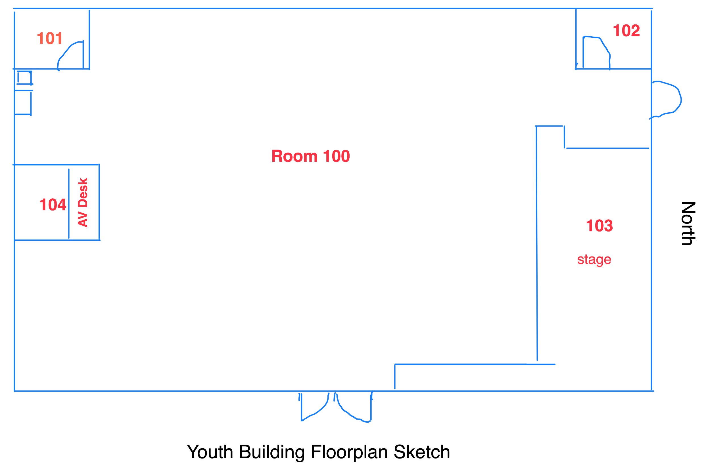

```{r packages_functions }
source('commonPackages.R')
source('commonFunctions.R')
source('commonDiagram.R')
```

```{r get_data}
db.assets <- get.inventory()  
db.cables <- get.cables()
```

# Introduction

This is a detailed design report for the Audio, Video, and Network systems in the Youth Building.

Throughout the documentation, there will be references to "Room" numbers. The building has been divided into rooms, to be able to talk about a location more precisely. Not all rooms have walls.



```{r gt_room_list}
get.rooms() |>
	filter(Building=="B2") |>
	arrange(Room) |>
	select(Room, CommonName,	Description,	Usage ) |>
	gt() |>
	tab_header("Room Directory") |>
	opt_stylize(style=3) |>
	cols_label(Room = "Room#"
			  , CommonName = "Name"
			  , Description="Description"
			  , Usage = "Usage")
```

# Audio Inputs Diagram

::: {#fig-audio-inputs .cell-output-display}
```{r audio_inputs, results="asis" }
label <- "'Audio inputs'"

targets <- c('2308-0906', 'CDWU-A002', '2308-0914', "2308-0008"
			  ,'ZAKU-A001'
			  , "RearGuest"
			 ,"2310-2500", "2309-2503", "2309-2504") 

xd <- c("youthswitch", "2308-0902", "2308-0002", "VMNU-0029", 
		"2308-0006", "2308-0008", "d228", "d229", "d227", "b236"
		,"2308-0908","2308-0911","2308-0903"
		, "2405-2502")
dot_code <- get_diagram(targets, db.assets, db.cables
						, label=label , exc_dev=xd )
out_str <- get_diagram_aux(dot_code)
cat(out_str)

```

Audio Inputs
:::

# Audio Outputs Diagram

::: {#fig-audio-outputs .cell-output-display}
```{r audio_out, results="asis" }
targets <- c( '2404-1700' #qu24
			, '2404-2701' #HL
			, '2404-2702' #HR
			, '2404-2703' #mon 1&2
			, '2404-2704' #mon 3&4
			, '2404-2705' #cat6 audio
			, '2404-2706' #cat6 audio
			
		  , '2308-1000'
			, "2311-0200",  "2311-0201", "2311-0202"
			, "2311-0204",  "2311-0205", "2311-0206", "2311-0207"
			, "2311-0206" 
			)

label <- "'Audio Outputs'"
xd <- c('CDWU-A002', "2308-0910", "2308-0911"
		, "2308-0909"
		, "2405-2502" #patch panel
		)

dot_code <- get_diagram(targets, db.assets, db.cables, label=label, exc_dev=xd)
out_str <- get_diagram_aux(dot_code)
#dot_code |> clipr::write_clip()
cat(out_str)
#
```

Audio Outputs
:::

```{r temp}
x <-'2310-2500'
db.cables |> 
	filter(SrcTag == x | DstTag== x | str_detect(Tag, x)) |> 
	select(-Invoice,   -`Labelled?`) |>
	arrange(SrcTag, DstTag) |>
	gt() |> 
	opt_stylize(style=3) |>
	tab_header("Snake Connected Cables")
```

```{dot}
//| label: fig-sdy-audio-outputs4
//| fig-cap: "Audio system simplified"
//| file: ./gv/sdy-audio-outputs4.gv
```

# Video System Diagram

::: {#fig-video-system .cell-output-display}
```{r video_digram, results="asis" }
targets <- c(   '2308-0002'
, '2308-0003'  
, "2309-1600", "2309-1601")
 
xd <- c('youthswitch')
dot_code <- get_diagram(targets, db.assets, db.cables
						, label="'Video System'"
						, exc_dev=xd)
out_str <- get_diagram_aux(dot_code)
cat(out_str)
```

Video System
:::



# Network Diagram

::: {#fig-network .cell-output-display}
```{r network_digram, results="asis"}
targets <- c( "NSTU-H001", 
  "2405-2502")
 
dot_code <- get_diagram(targets, db.assets, db.cables, label="'Network System'")
out_str <- get_diagram_aux(dot_code)
cat(out_str)
```

Network
:::

::: {#fig-youth-network .cell-output-display}
```{r youth-network2, results="asis"}
label <- "'Youth Network - Edge Switch'"

targets_v <- c( "NSTU-H001" # youth switch
			   , "NAHU-H001" # wap switch
			   , "2404-1700" # audio mixer
			   , "2405-2502" # patch panel
			   ,"2404-2705", "2404-2706" #audio snake 
			 ) 

xd <- c( "2404-2701" #audio amp
	   , "2404-2702" #audio amp
	   , "2404-2703" #audio amp
	   , "2404-2704" #audio amp
	    , "CDWU-A001" # FH COmputer
		 , "NAHU-B008" #FH WAP
		 , "NCPU-H002"
		) 

dot_code <- get_diagram(targets_v
						, db.assets, db.cables
						, label=label , exc_dev=xd )
out_str <- get_diagram_aux(dot_code)
cat(out_str)
#grViz(dot_code)
```

Youth Network - Edge Switch
:::



# Audio Inventory

```{r audio_inventory}
#| label: tbl-audio_inventory
#| tbl-cap: Audio Inventory
#| tbl-cap-location: bottom

asset_items <- db.assets |>
	filter(Category == 'Audio'
		   & Building == 'B2' 
		   & Disposition == 'N') |> 
	filter(!is.na(Building) ) |>
	arrange(AssetTag) |>
	mutate(ManuModel = md(glue("{Manufacturer}<br>{Model}"))) |>
	mutate(loc = md(glue("{Room}<br>{Location}")) ) |> 
	select(AssetTag, SN, ManuModel, Type, loc, Desc) 

nr <- nrow(asset_items)
mhdr <- glue("Installed Audio Devices in the Youth Building")
shdr <- glue("n={nr}")

asset_items |>
	gt() |>
			opt_stylize(style = 3) |>
	tab_header( glue("Audio Inventory ")
			   
			  )   |>
	tab_style(
		style=list( cell_text(weight = "bold") ),
		locations=cells_body(columns=AssetTag)
	) |>
	tab_header(mhdr, subtitle = shdr) |>
	sub_missing(missing_text="") |>
	fmt_markdown()
```

```{r audio_cables}

cable_items <- db.cables |>
	filter(SrcTag %in% asset_items$AssetTag | DstTag %in% asset_items$AssetTag) |>
	filter(!is.na(SrcTag) & !is.na(DstTag))

nr <- nrow(cable_items)
mhdr <- glue("Installed Audio Cables in the Youth")
shdr <- glue("n={nr}")

cable_items |>
	arrange(Tag) |>
	select(Tag, SrcTag, SrcPort, DstTag, DstPort, Type, Usage, Notes) |>
	gt() |>
	opt_stylize(style=3) |>
	tab_header(mhdr, subtitle = shdr) |>
	sub_missing(missing_text="")

```



# Video Inventory

```{r video_inventory}
#| label: tbl-video_inventory
#| tbl-cap: Video Inventory
#| tbl-cap-location: bottom

asset_items <- db.assets |>
	filter(Category == 'Video'
		   & Building == 'B2' 
		   & Disposition == 'N') |> 
	filter(!is.na(Building) ) |>
	select(AssetTag, SN, Manufacturer, Model, Type, Desc) 

nr <- nrow(cable_items)
mhdr <- glue("Installed Video Devices in the Youth")
shdr <- glue("n={nr}") 

asset_items |>
	gt() |>
			opt_stylize(style = 3) |>
	tab_header( glue("Video Inventory ")
			   
			  )   |>
	tab_style(
		style=list( cell_text(weight = "bold") ),
		locations=cells_body(columns=AssetTag)
	)
```

```{r video_cables}
cable_items <- db.cables |>
	filter(SrcTag %in% asset_items$AssetTag | DstTag %in% asset_items$AssetTag) |>
	filter(!is.na(SrcTag) & !is.na(DstTag))

nr <- nrow(cable_items)
mhdr <- glue("Installed Audio Cables in the Youth")
shdr <- glue("n={nr}")

cable_items |>
	arrange(Tag) |>
	select(Tag, SrcTag, SrcPort, DstTag, DstPort, Type, Usage, Notes) |>
	gt() |>
	opt_stylize(style=3) |>
	tab_header(mhdr, subtitle = shdr) |>
	sub_missing(missing_text="")
```



# Network Inventory

```{r net_inventory}
#| label: tbl-net_inventory
#| tbl-cap: Network Inventory

asset_items <- db.assets |>
	filter((Category == 'Network'
		   & Building == 'B2' 
		   & Disposition == 'N' ) 
		   | (AssetTag == "CDWU-A002" | AssetTag == "2308-0003") 
		   ) |> 
	filter(!is.na(Building) ) |>
	arrange(AssetTag) |>
	select(AssetTag, SN, Manufacturer, Model, Type, Location, Desc) 

nr <- nrow(asset_items)
mhdr <- glue("Installed Network Devices in the Youth Building")
shdr <- glue("n={nr}")

asset_items |>
	gt() |>
			opt_stylize(style = 3) |>
	tab_header( mhdr, subtitle=shdr )   |>
	tab_style(
		style=list( cell_text(weight = "bold") ),
		locations=cells_body(columns=AssetTag)
	) |>
	tab_header(mhdr, subtitle = shdr) |>
	sub_missing(missing_text="")
```

```{r net_cables}
cable_items <- db.cables |>
	filter(SrcTag %in% asset_items$AssetTag | DstTag %in% asset_items$AssetTag) |>
	filter(!is.na(SrcTag) & !is.na(DstTag))

nr <- nrow(cable_items)
mhdr <- glue("Installed Network Cables in the Youth")
shdr <- glue("n={nr}")

cable_items |>
	arrange(Tag) |>
	select(Tag, SrcTag, SrcPort, DstTag, DstPort, Type, Usage, Notes) |>
	gt() |>
	opt_stylize(style=3) |>
	tab_header(mhdr, subtitle = shdr) |>
	sub_missing(missing_text="")

```

# Appendix



```{r mixer_quick_reference}
mqr <- tribble(
  ~InOut, ~Number, ~Usage
, "In",   "1",    "Piano"
, "In",   "2",    "Guitar or Front Guest computer"
, "In",   "3",    "Guitar"
, "In",   "4",    "Vocal 1"
, "In",   "5",    "Vocal 2"
, "In",   "6",    "Vocal 3"
, "In",   "7",    "Vocal 4"
, "In",   "8",    "Vocal 5"
, "In",   "17",   "Wireless Mic"
, "In",   "21/22", "Rear Guest"
, "In",   "23/24", "Rear Computer"

, "Out",  "1",    "Vocals (Front)"
, "Out",  "2",    "Keys"
, "Out",  "3",    "Back"
, "Out",  "4",    "Drums"
)

mqr |>
	gt(groupname_col = "InOut") |>
	opt_stylize(style=3) |>
	cols_label() |>
		tab_style( 
		style = cell_text(weight ="bold")
		, locations = cells_body()
	) |>
	tab_header("Mixer Inputs and Outputs") |>
	cols_align(
		  align = c("left"),
		  columns = "Number"
)

```



## Running the Computer/Video System

1.  The computer in the cabinet will be either in sleep mode or off. Hit the on switch to turn it on. If it doesn't turn on, check if the power supply is off.
2.  Use the white remote with green/grey buttons near the computer desk to turn on the projector. Stand directly below it, and wait for the light to change from orange to green, the screen may take a minute or two to warm up.
3.  If the computer is off, you might see a black screen. If it shows a blue screen, switch the output from C to D by pressing the "Input" button on the remote. Remember to switch it back to C when leaving.

## Running the Audio System

1.  Turning the audio system on and off - it is important to do so in the right sequence (or else you will hear very loud and damaging pops). Rear switch on first and off last. Front switch off first and on last. (see labels on the switches)
2.  Recall the your scene. Press the "Scene" button and then touch the name of the desired scene, and then touch "Recall". There is a scene for "Plugged in" and a scene for "UMAC".

## Basics in Audio

1.  Each singer/instrument has a channel with a mute button above the faders. Unmute only necessary channels.\
2.  Adjust the "Gain" to control audio input to the board. Aim for a bright green light without red. Press the "Sel" button at the top of the strip and then adjust using the "Gain" knob top left.
3.  Watch for feedback, caused by sound looping from monitors/speakers into microphones. Reduce channel levels in the monitors or adjust singer positions if needed.
4.  Use the faders to control audience audio. Make sure the "LR" button has a blue light.
5.  To adjust the any of the monitors, press the "Mix" button on the right for the desired monitor. For example "Mix 1" is the very front monitor.
6.  The mentality is to have the singers be the loudest so the audience can follow along, and the have the instruments at a balanced level to it all sounds as one.
7.  Good luck! Remember to pray as it is key for the audience to engage with hearing the word of God.
