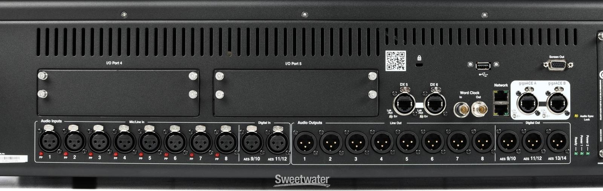
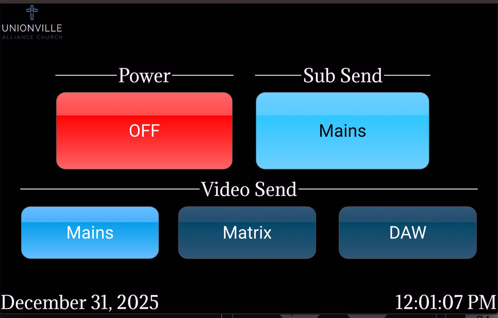
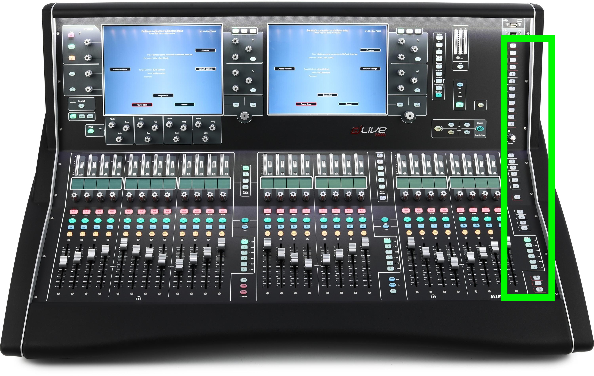
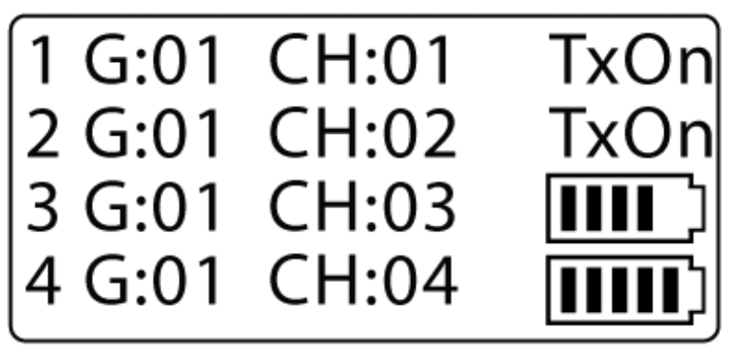

```{r setup, include=FALSE}
source("commonPackages.R")
```

```{r functions}
source("commonFunctions.R")
source("commonFunctionsAudio.R")
```

```{r data}
db.inventory <- get.inventory()
db.cables     <- get.cables()
```

# Introduction
This document provides basic operating information for each of the main auditorium audio system at UAC.

Purpose of our Sound System:

* Necessary to help the hearing impaired ( roughly 10% of the population) 
* Supports video recording and streaming
* For music, creates a pleasing blend of all the instruments and vocals
* Helps audience to focus and concentrate
* Reinforces the message (spoken or sung)

## Audio System Overview


```{dot fig-soa-system-overview }
//| label: fig-soa-system-overview
//| fig-cap: Audio System Overview
//| cap-location: bottom
//| file: gv/soa-audio-overview.gv
```

# Power On and Off

## Power On

To the left of the audio console there is a small touch screen that displays the church logo. 

* Touch it once to bring up the menu.
* In the upper left there will be a button that says "Off", which is the current state, touch it and the system start up sequence will begin.
* Wait about two minutes and the system will be ready to use.
* Meanwhile take off and stow the dust cover.
* The next step is, typically, to recall the desired scene. To do so touch the "scene" button on the right hand side of the console. Then on the right hand console screen, scroll to find the scene you want, touch it and then press the "Go" button which is also on the right hand side. 
  
:::{.callout-important}
If you don't know what scene to use, please discuss with Terry.
:::

:::{.callout-note}
Although not part of the audio system, it is often the audio engineer who turns on portions of lighting (blue button) and video system (switch #4) as well
::: 
 
## Power Off 

* on the right side of the console, push the "Home" button.
* on the right screen, there will be a button labelled "Power Down", touch it.
* put on the dust cover
* on the mini touch screen on the left side of the console, touch it once to bring up the menu, and then touch the "On" button in the upper left. The system will then begin the power down sequence.

# Training Videos

See (@fig-training-videos) for a list of training videos. The titles are links you can follow.
 
```{r training}
#| tbl-cap: "Training Videos"
#| tbl-cap-location: bottom
#| label: tbl-training-videos
#| 
get.training() |>
  filter(Topic1=="Audio") |>
  filter(Topic2 %in% c(	"Console Operations", "Mixing" )) |>
  filter(Topic3 != "01 Basic DM1K"  ) |>
  mutate(Title = md(glue("[{Title}]({URL})"))) |>	
  select(Topic3, Episode, Duration , Title, Notes )  |>
  arrange(Topic3, Episode) |>	
  rename(Module = Topic3) |>
  gt(rowname_col = "Episode", groupname_col="Module") |>  
	   #summary_rows(fns = list("n") ) |>
		opt_stylize(style = 3) |>
	    opt_row_striping(  row_striping = TRUE) |>
	fmt_markdown(
  columns = "Title",
  rows = everything(),
  md_engine = c("markdown")) |>
  sub_missing( columns =  "Notes",
				rows = everything(),
				missing_text = "---") |>
	cols_align( align =   "left"  ,
				columns =  "Title")
```

There is a good collection of videos on YouTube from the [Dante Certification program](https://www.audinate.com/learning/training-certification/dante-certification-program) . You can enroll in the program which will give you access to all of the videos. The level 1 videos are listed here @fig-training-videos-dante.

```{r training-dante}
#| tbl-cap: "Dante Training Videos"
#| label: tbl-training-videos-dante
#| 
get.training() |>
  filter(Topic1=="Audio") |>
  filter(Topic2 %in% c(	  "Dante")) |>
  filter(Topic3 == "Level 3") |>
  mutate(Title = md(glue("[{Title}]({URL})"))) |>	
  select(Topic3, Episode, Duration , Title, Notes )  |>
  arrange(Topic3, Episode) |>	
  rename(Module = Topic3) |>
  gt(rowname_col = "Episode", groupname_col="Module") |>  
	   #summary_rows(fns = list("n") ) |>
		opt_stylize(style = 3) |>
	    opt_row_striping(  row_striping = TRUE) |>
	fmt_markdown(
  columns = "Title",
  rows = everything(),
  md_engine = c("markdown")) |>
  sub_missing( columns =  "Notes",
				rows = everything(),
				missing_text = "---") |>
	cols_align( align =   "left"  ,
				columns =  "Title")
```

There is also an extensive library of videos on MxU. 

# Console Inputs

There are four interfaces which facilitate inputs to the dLive system. In total all possible inputs map to the system maximum of 128 inputs.

Part of what is included in the scene definition is the channel layout. 

__1. DM64 Inputs:__
 The analog input jacks on the DM64 mounted in the amp rack. There are 64 inputs. The first 52 of those are wired to the jacks in the floor pockets on stage.
 
The inputs "Inst10" through Inst14" are meant for guest instruments such as a violin, flute, or Sax. They are setup this way so they are also readily available to broadcast and IEM mixes.
 
```{r mixrack-inputs-analog, eval=TRUE}
#| label: tbl-mixrack-inputs-analog
#| tbl-cap: MixRack Analog Inputs
get_inputs("2407-3000") |>
   select(DstTag, DstPort, Usage) |>	
  gt() |>
  tab_header("dLive MixRack Analog Input Map") |>
  opt_stylize(style=3) |>
	sub_missing(  missing_text = "-")  
``` 


```{r ins_mixrack}
# "2407-3000" is the DM64 in the amp rack

db.cables |>
	filter(DstTag == "2407-3000") |> 
	filter(SrcPort != "DX1") |>
	filter(str_detect(SrcTag , "FB")) |> # from a floor box
	select(SrcTag, SrcPort, DstPort, Usage, Notes) |> 
	gt() |>
	opt_stylize(style=5) |>
	tab_header("dLive Analog Inputs Via Floor Boxes") |>
	cols_label(SrcPort = "Jack",
			   SrcTag = "Floor Box",  
			   DstPort = "MixRack Input") 
```


__2. DX168 Inputs:__
There are 16 analog inputs in the small stage rack located next to the drum riser. There are used for the drum inputs, and the bass. 

```{r mixrack-dx168-analog, eval=TRUE}
#| label: tbl-mixrack-inputs-dx168
#| tbl-cap: DX168 Drum rack Analog Inputs
get_inputs("2410-1902") |>
   select(DstTag, DstPort, Usage) |>	
  gt() |>
  tab_header("dLive DX168 Drum Rack Analog Inputs") |>
  opt_stylize(style=3) |>
	sub_missing(  missing_text = "-")  
``` 

I am in the midst of changing the way I document the system config. The next table should be similar to the above but generated from the cabling database.

```{r ins_dx168}
# "2410-1902" is the DX168 in the on-stage rack

db.cables |>
	filter(SrcTag == "2410-1902") |> 
	filter(SrcPort != "DX") |>
	select(SrcPort, DstPort, Usage, Notes) |> 
	gt() |>
	opt_stylize(style=5) |>
	tab_header("dLive Analog Inputs Via DX168") |>
	cols_label(SrcPort = "DX168 Port",
			   DstPort = "MixRack Input") 
```

__3. Dante Inputs:__
I/O expansion port #1 on the DM64 is fitted with a 128x128 port Dante card. This is used for 16 inputs from the Shure ULXD receivers, two inputs from the ProPresenter computer, and 64 inputs from the Propresenter computer used for Virtual Soundcheck. The other computers can also provide Dante inputs.

```{r mixrack-dante-inputs, eval=TRUE}
#| label: tbl-mixrack-dante-inputs
#| tbl-cap: MixRack Dante Inputs
get_inputs("2407-3002") |>
	filter(DstPort < 20) |>
   select(DstTag, DstPort, Usage) |>	
  gt() |>
  tab_header("MixRack Dante Inputs") |>
  opt_stylize(style=3) |>
	sub_missing(  missing_text = "-")  
``` 

```{r}
o1 <- get_outputs("ZAMU-A001")
o2 <- get_outputs("ZAMU-B001") 
o3 <- get_outputs("ZAMU-B002") 
o4 <- get_outputs("ZAMU-B003")

rbind(o1,o2,o3,o4) |>
	pivot_wider(names_from = "SrcTag"
				, values_from = "Usage") |>
	gt() |>
    tab_header("Shure Sources via Dante") |>
    opt_stylize(style=3) |>
	sub_missing(  missing_text = "-") 
```

Virtual Sound Check is enabled by going into the IO settings and the "Virtual SoundCheck" tab. When enabled, the normal inputs are overridden with the VSC configuration. These inputs are applicable:

```{r mixrack-dante-inputs-vsc }
#| label: tbl-mixrack-dante-inputs-vsc
#| tbl-cap: Dante Inputs for Virtual Sound Check
get_inputs("2407-3002") |>
	filter(DstPort > "in_64" ) |>
   select(SrcTag, SrcPort, Usage) |>	
  gt() |>
  tab_header("MixRack Dante Inputs for Virtual Sound Check") |>
  opt_stylize(style=3) |>
	sub_missing(  missing_text = "-")  
``` 

__4. Surface Inputs:__ The console surface has 8 analog inputs on the back which are used for the talkback mic, the reference mic, the guest computer and the CD Player.

Part of what is included in the scene definition is the channel layout. 

```{r s5000-analog-inputs }
#| label: tbl-s5000-analog-inputs
#| tbl-cap: S5000 surface Analog Inputs  
get_inputs("2407-3001") |> 
  select(SrcTag, SrcPort, DstPort, Usage) |>	
  gt() |>
  tab_header("S5000 Surface Analog Inputs") |>
  opt_stylize(style=3) |>
	sub_missing(  missing_text = "-")  
```

{#fig-sda-s5000-rear.jpg width=125mm}

# Console Outputs

Similar to the system inputs, there are outputs in four separate interfaces. 

__1. DM64 Outputs:__
There are 32 analog outputs on the front face of the DM64 mounted in the amp rack. Two of those are used as analog backup 

__2. DX168 Outputs:__
Not used.

__3. Dante Outputs:__ 
There are 128 Dante outputs: 
The Dante outputs are in two categories: 

1. Most of the inputs are send out via Dante as Direct Outs. These are picked up by Reaper as the broadcast DAW and by Klang:Konductor for IEM inputs. 

2. Many of the Mix busses are sent out via Dante as well, including all monitor mixes (8), the sub out matrix (1), the video matrix (2) and the FoH LR main mix (1). For a total of 12 such outputs. 

Because there are upto 128 active inputs and an addtional 12 outputs, some of the 128 Dante outputs cannot be linked to the Direct Outs. 

:::{.callout-note}
TODO  - update to dLive config.
:::

 

__4. Surface Outputs:__ 
There are no surface outputs in regular use. If there was a need for an output to send to a videogapher or such, these outputs could be used for that, but they are not currently pre-configured for that. (I would likley route the mains in parallel for that scenario)

{#fig-sda-s5000-rear.jpg width=125mm}

## Monitors

We have eight monitor amplifier channels, each which can handle a load of two of our monitor wedges. 

Our standard monitor configuration is (@fig-monitors), however with our usage of the IEMs, these are not all that often used.

```{r gt.monitors}
#| label: tbl-monitors
#| tbl-cap: Standard Monitor Map
get_monitors() |>
	gt() |>
	tab_header("Standard Monitor Map") |>
	opt_stylize(style=3) 
```

## Lobby

The lobby mix is a matrix driven off of a matrix mix for the lobby.

## Subs

The standard mode of operation drives the subs from the main LR mix. However, if the engineer so desires, the subs can be driven from the subs Aux buss. This routing choice is made via the touch panel. 

The button under the "Sub Send" title selects whether to feed the subs from the **Mains** or the **Aux**. The button is a toggle.

{#fig-soa-scene-recall width=65mm}

## Video Mix

We have three ways of sending audio to the video mixer. The choice is made using the touchscreen panel. There are three choices underneath "Video Send": **Mains**, **Matrix** and **DAW**. The light blue item is the active item.

{#fig-soa-scene-recall width=65mm}

Mains
: The **Mains** option routes the main FoH audio mix to the video mixer. It tends to be too quiet so needs the audio controls in the ATEM video mixer to be boosted.

Matrix
: The **Matrix** option routes the "2Video" matrix bus to the video mixer. By default this mix consists of the Main LR bus but with elevated levels. One has the option of doing a full custom mix using this matrix.

DAW
: The **DAW** option routes the output of Reaper to the video mixer. This *mostly* bypasses the FoH mixer - All inputs still come into the FoH mixer preamps but are then routed via the Direct Outs (after gain, before trim) to Reaper (via Dante).

# Effects

Four Stereo busses have been allocated for Effects. The master scene configures those as **Plate**, **Hall**, **Chorus**, and **Delay**. There are softkeys that will pull up the effects sends on faders (keys 20-23). 

Bank 3, Layer F has the effect Send master. Bank 3, Layer B has the Effect returns.

:::{.callout-note}
TODO: I should reorganize those so that sends and returns are both on the same layer. (F for Fx?) .
:::

There is a DCA that is tied to the Fx returns for all Fx so you can quickly kill them.

# In-Ear Monitors (IEM)

The IEM system is managed by the Klang Hardware. All of the console's 128 Dante outputs are routed 1:1 to the Klang Konductor inputs. Konductor sends outputs via Dante to each of the Kontrollers and, in addition The first four Klang mixes (stereo pairs) are routed to the Quelle Interface device which converts to Analog and to Shure wireless transmitters for the IEM packs.

```{dot fig-sda-outputs-iem }
//| label: fig-sda-outputs-iem
//| fig-cap: IEM Topology
//| cap-location: bottom
//| file: gv/sda-outputs-iem.gv
```
  
# Basic Operations

## The Console

The main audio console is located in the balcony. It can also be operated remotely via dLive Director installed on the Mac in the broadcast room or a tablet running the dLive Mix App. To use director or the tablet/phone app, you must be connected to the correct network.

## Scene Recall 

Scenes are a collection of settings that can be stored and recalled together. This is a very effective way of getting to a good known state. We have created a scene (**Master #001**) which should be used as a base for start an event. This scenes is locked so that they cannot be easily overwritten. If you would like to make a change to a base scene, please discuss with Terry.

When recalling a scene, whatever is being recalled will (almost) instantly become active or inactive. You __don't__ what to do this when live, unless you know exactly what you are doing.

__Scene 001__

To recall Scene 001, press the scene button on the right hand side, and then using the right monitor, scroll to the top of the list where you will find "Master". Touch it to select it and then press the physical "Go" button to the right.   (@fig-soa-dlive-scene-recall).

{#fig-soa-scene-recall width=65mm}

## dLive Softkeys 

The softkeys allow the operator to quickly access common features. They are located on the very right hand side of the console, see figure @fig-soa-s5000-softkeys for the location and  @fig-soa-dlive-softkeys for the standard usage.

```{r}
#| label: tbl-soa-dlive-softkeys
#| tbl-cap: dLive Sof Keys
softkeys <- tribble(
~SoftKey , ~Function 
,"1","Monitor 1 to faders"  
,"2","Monitor 2 to faders"  
,"3","Monitor 3 to faders"  
,"4","Monitor 4 to faders"  
,"5","Monitor 5 to faders"  
,"6","Monitor 6 to faders"  
,"7","Monitor 7 to faders" 
,"8","Monitor 8 to faders"
,"20","Delay Tap-effect timing"
,"21","Plate effect to faders"
,"22","Hall effect to faders"
,"23","Delay effect to faders"
)

gt(softkeys) |>
	opt_stylize(style=3) |>
	tab_header("Softkeys Keys")
```

{#fig-soa-s5000-softkeys width=50mm}

 
# Operating a Channel

:::{.callout-important}
Some of the changes you make on channel inputs can also affect what happens on the Livestrean mixer. These require communication between the two engineers.

* Microphone selection for anything non-standard, or extra

* Adjustments to preamp gain (aka headamp gain), it is normal to change early during rehearsal, but after that a change should be communicated. 

* Other changes can also make an impact but are not likely to occur in normal operation. For example: adjusting the *Direct Out* levels of certain channels, or adjusting the mix or master level of busses 11-14.

See @fig-dante-outputs for more details.
:::

The channels are laid out 32 on the left hand side and 16 on the right; all in groups of 8. The bank of 8 faders in the centre mirrors one of those groups or can be used to access other functions like the monitor masters. 

## The Buttons

Each of the channel strips has three buttons, **SEL**, **CUE**, and **ON**.

__SEL__

The **SEL** button *selects* that channel and brings it into focus on the display. The knobs to the left of the display make the adjustments to the selected channel.  

__CUE__

The **CUE** button activates that channel to be heard via the headphones. The volume on the headphones can be adjusted via the monitor level below-right to the screen as well as the the knob under the wrist rest in the centre. 

Multiple channels can be **CUE**d at the same time. 

__ON__

The **ON** button turns the channel on. 

:::{.callout-note}
Turning a channel off also affects the direct out send to the livestream mixer.
:::

## Monitors on Faders

To adjust the monitor mix you can press on of the buttons labelled "M1" thru "M6" to the lower-right of the screen. Pressing the same button will revert the faders to the main mix.

## Preamp Gain Adjustments

The preamp gain is also refered to as *Head Amplifier*, and abbreviated *HA*.

The means to adjust the preamp gain follows one of two methods: Analog (wired) inputs and Dante (wireless) inputs.

Adjusting the preamp input gain also affects the level sent to the livestream mixer.

__Analog (wired) Inputs__

To adjust the gain for a microphone, use the **SEL** button and then use the **HA** knob. 

__Dante (wireless) Inputs__

The mixer cannot control the preamp gain for the wireless receivers. Instead this needs to be adjusted directly on the receivers. Each receiver is for 4 microphones and there are a pair of up-down buttons for each which will adjust the gain.

The wireless gain settings are not stored and recalled as part of the scene so you will inherit whatever was last used. 

## Handling Feedback

Audio feedback occurs when a microphone and a speaker, creates a loop in which sound from the speaker is picked up by the microphone and then amplified and re-emitted by the speaker. This results in a high-pitched, unpleasant squealing or howling noise. Audio feedback is an unintended and undesirable phenomenon in audio systems, and it can be caused by factors like microphone placement, high microphone sensitivity, or a loudspeaker's proximity to the microphone. 

To control/eliminate feedback, several approaches can be taken. In approximate priority of application:

* Turn off any other microphones that are not needed.

* Turn down the problem microphone in the speaker which is causing the problem. This could be a monitor or the main house.

* Change the placement of the microphone and/or the monitor speakers involved.

* Eq can be applied to reduce the level of the problem frequency. (Ear training helps the engineer quickly know what frequency to target.) You typically want a high Q, which means the EQ filter applies to a narrow band of frequencies.

* In some circumstances you can add a slight delay, less than 10 ms, on the problem microphone and that can inhibit the feedback cycle.

* Using the phase invesion switch can help when desperate but can cause other weird effects, especially of multiple microphones are in use.

# IEM Operations

The Klang:app is used to manage the IEM system. It is installed on the Mac in the broadcast room and can also be installed on a tablet or phone. To use the app, you must be connected to the correct network, "uac-media-iem". There is a sheet with the QR code to connect to the network in the broadcast room taped to the cabinet.

## Fixing Common IEM Problems

1) Somebody has really messed up their mix and cant hear anything (likely because they inadvertently ran everything to zero)?

Using the Klang:app, go into their mix. Take all the relevant group levels to zero and then bring up the individual channels to about -10 dB, with some discretion about what they might actually want to hear. A general guideline is to put the background channels (for them) at about -10 dB and what ever is needed for pitch and timing reference at zero, with their own channel at +5 db.  
 
2) A particular channel is on and it is causing problems for people - for example, say the peacher has turned their mic on at the beginning of the service and is singing along, and it is also turned up in the IEMs.

Using the Klang:app, find the channel in question and mute it in every IEM mix. At the moment that means you'd have to do it 11 times.   

:::{.callout-note}
There are other ways this can be done: 

Shure Wireless Workbench to mute the channel at the receiver - but that would also mute the channel for the FoH and live stream mixes, which means you'd have to remember to turn it back on when needed. 

At the console, you could also adjust the direct output level for that channel to zero and you would have to remember to bring it back up when needed.

Using Dante Controller, you could unpatch the mic. This method is not recommended. 
::: 
 
3) A musician finds a channel to be harsh. Make an EQ adjustment. 

Harshness is often in the 2-4 kHz range, but it could be elsewhere. You can use the custom EQ adjustment in the KLANG:app for that mix-channel combination to apply cut that frequency range.
 
4) A particular channel is not showing up on the Kontrollers. Make it visible?

Using the Klang:app, find the channel in question and make it visible on the Kontroller. This is done by selecting the mix (along the top), and then the "Channels" (along the left), find the needed channel and slide its 'switch' from 'off' to 'on'. 


# Operating the Wireless Microphones

We have 18 wireless transmitters and 16 receivers. A receiver can only be paired with on transmitter at a time, which means we can have, at most 16 active transmitters.

Of the 18 transmitters, 12 are handheld microphones, and 6 are beltpack units that can be fitted with either a headset or lavalier microphone.

The six beltpack transmitters are all routed to the A&H Mixrack via Dante. 

Handheld transmitters 1-10 are typically used for vocalists, and 11 and 12 are used for talkers. 

__Battery Management__

Each transmitter takes two AA batteries. The battery level is visible on both the transmitter and the reciever displays. When using Duracell Coppertop batteries each 'segment' on the display indicates about 30 minutes of runtime, but never count on the last segment. In figure @fig-soa-battery1, channel 3 has about 1.5 hours of runtime and channel 4 has about 2 hours (5 segments minus one). 

The display on the microphone is similar, but for one channel only.

{#fig-soa-battery1 width=65mm}

Old batteries are to be discarded in the collection bin to the left of the console.

__Head Amp Gain__

The pre-amplifier gain can be controlled from the console via the RF section of the preamp settings or directly on the Receiver front panels. 

The gain setting on the console does affect the signal level sent to both the livestream mixer and the IEM system. So it is important to get your preamp settings correct very early in rehearsal. If you need to make adjustments after that it is best to use the trim setting on the console rather than the preamp gain, because the trim setting does not affect the signal sent to the livestream mixer and IEM system.
 

# Appendix

## Audio Recording - Audio CD

We don't do this normally but if desired this is how.

Key Steps:

#. Place a blank CD into the recorder and close the tray. It will take a few moments to recognize the disc type.
#. Press the Auto/Manual (or is it tracking) button on the left hand side to select whether you want new tracks created automatically or not.
#. Press the record button to begin recording
#. Press the record button again to start a new track when desired.
#. Press stop when done. The display will flash a PMA message for a few moments
#. To Finalize. 
    * Press the "Finalize" button, it will think for a moment or three and the display will show a time. (usually 2:01). 
    * Push Play and it will begin finalizing. The time will count down.
    * Eject disc, remove disc
    * Close tray.
#. If for some reason the audio CD was not finalized, put it back into the recorder and pick up the instructions at step #6.

## Terminology

```{r}
# A hack - gt doesn't provide a means of line-breaking for pdf. So we create a graphic and then include the graphic.

tab <- get.glossary() |>
	filter(Topic == "Audio" | Topic == "General") |>
	select(Term, Definition, Topic) |>
	arrange(Topic, Term) |>
    gt(groupname_col = "Topic") |>
	opt_stylize(style=3) |>
	fmt_markdown(columns=Definition) |>
	tab_style(
  style = cell_text(weight = "bold", size="large"),
  locations = cells_row_groups()
)
```

```{r glossary, results='asis'}
cat(print_gt_table(tab))
```


