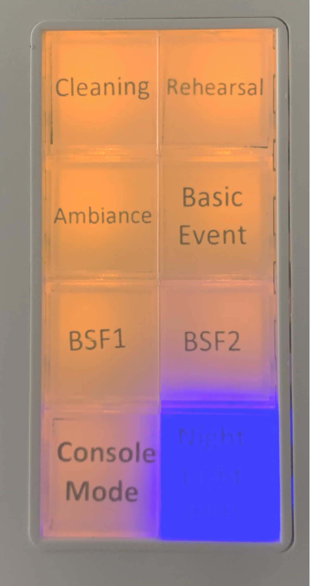
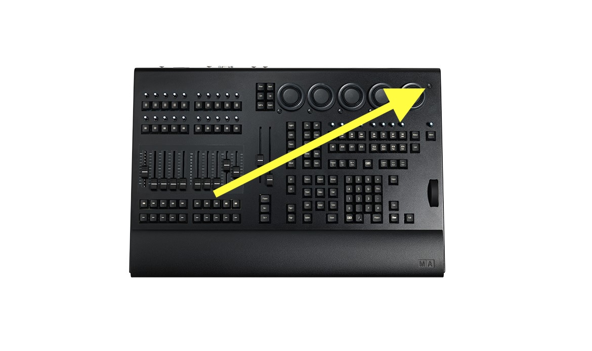
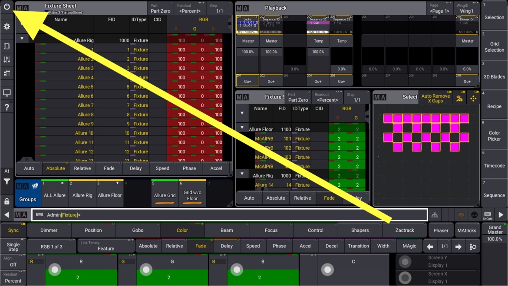
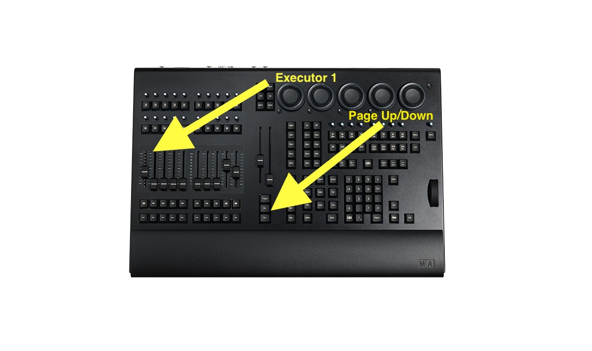
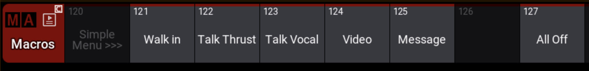
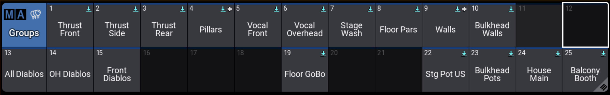

```{r packages }
source("commonPackages.R")
 
library(jpeg)
library(grid)
library(gt)
library(kableExtra)
library(lubridate)
```

```{r functions}
source("commonFunctions.R")
source("commonLightingKeypad.R")
```

```{r get_data}
dmx.details <- get.dmxdetails() 
```

# Introduction {#sec-intro}

This document provides basic operating information for Lighting systems for the auditorium at Unionville Alliance Church.

Purpose of the lighting system:

* Necessary to help the hearing impaired ( roughly 10% of the population) to lip read
* Supports video recording
* Helps draw attention to the central item – conversely makes it easier to ignore clutter
* Helps audience to focus and concentrate
* Reinforces the message (spoken or sung)
* Creates an immersive and beautiful environment in which to worship

There are two mechanisms to control the lighting: 

* A keypad located on the main floor by the south east auditorium doors. Users can select one of several preset configurations. 
* For more sophisticated control there is a lighting control console located in the balcony (a grandMA3 onPC command wing, 2607-2500).  It can be used for all lighting operations, especially more sophisticated lighting designs than can be accomplished via the keypad panel.

 

# Operating the Keypad {#sec-keypad}

There is a simple lighting control panel (ZLKU-B002) located next to the auditorium doors by the main office (south east). See @fig-sol-keypad . It enables the house lights to be set according to several pre-defined looks, of which there are 8.   Selecting one preset, deselects the previous preset - just like old-fashioned car radio buttons. A button turns blue when it is selected, orange otherwise.
The current list of available presets is found in @tbl-keypad-presets

The keypad and the main console can conflict with each other. When running from the console, the keypad must be in "Console Mode".  (You won't harm any equipment by having the keypad in the wrong mode, but the system will not work properly!)

The "Night Light" preset should be selected when the room is not in use.

The sconce lights also have a timed switch which is next to the keypad, **if you want sconce control during the day you will need to manually turn them on as well**. The timer is programmed to turn on the sconce lights during the evening hours (up to midnight), and Sunday morning.

{width=15% #fig-sol-keypad}

```{r  }
#| tbl-cap: "Keypad Presets"
#| tbl-cap-location: bottom
#| label: tbl-keypad-presets

keypad <-  get_keypad_buttons()  %>% rename(Description = B_Description)

keypad %>%
  arrange(Button) %>%
  gt() |>
  opt_stylize(style=3) |>
  tab_style( style = list(  cell_text(weight = "bold") ),
    locations = cells_body(  columns = "Button"  ) ) |>
  cols_align(align="left", columns = "Button")	
```

# Lighting Power Control

## Power On

1. In the balcony closet, turn on the main breakers at the top of the panel as indicated by the arrow and yellow box in the diagram below @fig-breakerbox.

{width=25% #fig-breakerbox}

2. Turn on the lighting console (see @fig-console-power)


{width=25% #fig-console-power}

3. Switch the keypad (by office doors) to "Console Mode".

## Power Off

Initiate shutdown in the software. Use the Power/shutdown icon at the top left of the Control Bar (see @fig-console-shutdown), or type `Shutdown` in the command line and confirm. The Shutdown function asks for confirmation and can be cancelled within 10 seconds. It closes onPC and triggers a proper Windows shutdown of the console computer.

{width=25% #fig-console-shutdown}

:::{.callout-important}
When leaving the system for the day ensure that the lower level keypad is set to "Night Light" (the button will turn blue). 
:::

# Controlling the Lighting System {#sec-controlling}

Basic operations of the house lights can be accomplished by using the keypad - which was discussed in the previous section.  

Advanced operations of house and theater lighting is accomplished via the lighting console in the balcony. See the section below for more details. 

:::{.callout-important}
**The keypad needs to be in "Console Mode" for this to work properly.**
:::

We can also use ProPresenter to fire pre-defined cues via macros. Using this technique a macro can be placed on a slide within a ProPresenter document and when that slide is displayed, the macro will instruct the lighting console to change to the corresponding cue number. ProPresenter macros can also be fired directly from the macro menu. There are a few things which must be set for the macros to work:

#. The lighting console must be on
#. The fader (executor 1) on page 1 must be up. See @fig-exec-1
#. CueCommanderNR must be running,  see @sec-cuecommander 

{#fig-exec-1 width=33%}

# Operating the GrandMA3 Console

This is the primary and most capable way of controlling (almost) all lighting in the auditorium. Basic operations are straightforward, and it is not too hard to create some sophisticated looks.  

What cannot be controlled from the console? 

* The balcony railing lights,   
* The sconce light switch (but if the sconce light switch is 'on' the console can control the sconce lights.) and, 
* The emergency lighting is a completely independent system. It is activated when there is a power outage.
    
::: {.callout-important }
If during the service there is a fire alarm, bring all house lights to full white. The quickest way is the keypad **Cleaning** preset (button 1, see @tbl-keypad-presets), which puts the house and stage pots on full white and does not depend on the console. 
:::    

## Simple Console Operations

On the far right of the right screen, there is a vertical menu. If you scroll to the top of that, you will see a button labelled "Simple Menu" (you may need to scroll using the mouse wheel). Touching that button will bring up a simple menu of operations.  

On that screen will be a list of the most common operations. Touching one of those buttons will execute that operation. See @fig-simple-menu

{#fig-simple-menu width=75%}


```{r}
#| label: tbl-simple-macros
#| tbl-cap: Simple Macros
#| tbl-cap-location: bottom

tab <- tribble(
	~Macro, ~Description,
	"Walk in", "Walk-in lights",
	"Talk Thrust", "Talk lights on thrust",
	"Talk Vocals", "Talk lights on vocals (Down Stage Centre)",
	"Video", "Dim lighting for video playback",
	"Message", "Bright lighting for message",
	"All Off", "All lights off"
) 

tab |>
	gt() |>
	opt_stylize(style=3) |>
	tab_style( style = list(  cell_text(weight = "bold") ),
    locations = cells_body(  columns = "Macro"  ) ) |>
	cols_align(align="left", columns = "Macro")
```

## Intermediate Console Operations

Our primary set of *looks* is in *sequence* 1. You can use any of the predefined cues in that sequence by using commands of the form `Goto Seq 1 Cue <cue number>`.  

The three digit cue numbers are structured. The first digit is the primary colour in the cue. The second digit is the secondary colour in the cue. The third digit is the cue number within that colour combination. For example, cue 123 is a cue with primary colour 1, secondary colour 2 and it is the third cue in that combination. There maybe variations of that cue as indicated by a ".n", where n is the variation number. For example, cue 123.2 is the second variation of cue 123. Using the colour index in @tbl-colour-index, cue 123 has a primary colour of Red and a secondary colour of Green.


```{r}
#| label: tbl-colour-index
#| tbl-cap: Colour Index
#| tbl-cap-location: bottom

tribble(~Digit, ~Colour,
	   1, "Red",
	   2, "Green",
	   3, "Blue",
	   4, "Yellow",
	   5, "Cyan",
	   6, "Magenta",
	   7, "White",
	   8, "Orange/Amber"
	   ) |>
	gt() |>
	opt_stylize(style=3) |>
	tab_style( style = list(  cell_text(weight = "bold") ),
    locations = cells_body(  columns = "Digit"  ) ) |>
	cols_align(align="right", columns = "Digit")
```

### Groups

We have a pool of predefined groups which can be used to create new cues. 
The groups are shown on the console in @fig-standard-groups and described in @tbl-standard-groups. 

{#fig-standard-groups width=85%}
 
```{r}
#| label: tbl-standard-groups
#| tbl-cap: Standard Groups
#| tbl-cap-location: bottom

tribble(~Group, ~Description,
	"Thrust Front", "The front lights on the thrust",
	"Thrust Side", "The side lights on the thrust",
	"Thrust Rear", "The rear lights on the thrust",
	"Pillars", "The pillar lights - the four lights in the stage corners",
    "Vocal Front", "The front lights on the vocalists",
    "Vocal Overhead", "The overhead lights on the vocalists",
	"Stage Wash", "The stage wash lights",
	"Floor Pars", "The floor par lights on the stage",
	"Walls", "The wall wash lights that extend beyond the stage",
	"Bulkhead Walls", "The bulkhead wall wash lights",
	"OH Diablos", "The overhead diablos on the stage",
	"Front Diablos", "The diablos for stage front lights",
	"Floor GoBo", "A GoBo light from the balcony west bar",
	"Stg Pot US", "The stage pots located upstage ",
	"Bulkhead Pots", "The bulkhead pot lights",
	"House Main", "The main house lights, including the balcony and the under balcony pot lights",
	"Balcony Booth", "The balcony lights located over the media arts desk"
) |>
	gt() |>
	opt_stylize(style=3) |>
	tab_style( style = list(  cell_text(weight = "bold") ),
    locations = cells_body(  columns = "Group"  ) ) |>
	cols_align(align="left", columns = "Group")
```

::: {.callout-note }

We don't currently have a group defined for the sconce lights as they are rarely used from the console. They can only be controlled from the console when the sconce timer switch by the keypad is on (see @sec-keypad). 

The thrust is the portable steps and platform in front of the main stage.
:::  

### Saving the Show

For long term storage you can save your show to a file or a USB stick. Save the current settings before overwriting with your saved show.

```{r  LightingPlots}
# this chunk is just a marker so that the lighting plot section is visible in the RStudio Outline.
```




# Blinds and Shades

We have two ways of controlling the light that enters the sanctuary via the exterior windows: semi-transparent shades and blackout blinds.

## Shade Operation

The semi-transparent shades are operated manually. There is a chrome chain in each window which runs the shade up or down.  

## Blackout Blind Operation

The blackout blinds operate as four banks of three blinds (one bank per wall). The switches are under the rear desk near the east end.
They are labelled: SE, NE, SW, and NW, which stands for the combinations of South, East, North and West.

Each switch has three positions: up, center and down. The up and down positions move the blinds in that direction. Centre is ‘off’, but does not stop a blind mid-way. When a blind is set to move in a direction it will do so until it is fully up or fully down. There are internal limit switches that will stop the blind at the limit. The switch does not have to be returned to the centre position.

To stop a blind mid-way while travelling, momentarily flick the switch in the opposite direction and then return the switch to the centre position. If you pause too long in the opposite direction the blind will reverse direction rather than stop.

::: {.callout-important}
When the service is over, please ensure that the blackout blinds are all the way up. If left down for long periods of time in the bright daylight, heat builds up between the blind and the window and the blind deforms and pops out of the track.
:::

<!--
#sec-cuecommander is defined in the include. 
-->



# Troubleshooting   

If a blackout blind pops out of its track
: Running the blinds up and down a **little** bit at a time can sometimes get them back in their track. An assistant at the blind can reach in behind and help guide them in. If it is more than a few inches, a ladder may be required to reinsert the blind into the track.

If the console cues or Simple Menu macros do not seem to do anything
: 1) Verify that the keypad by the office doors is in "Console Mode" (see @sec-keypad).
: 2) Verify that the console is on executor page 1 and that the executor 1 fader is up (see @fig-exec-1).
: 3) Verify that the Grand Master is at full.
: 4) Verify that Blind mode is off (the Blind key is highlighted when it is on).
: 5) Press **Clear** three times to empty the programmer - values in the programmer override the playback.
: 6) Fire the "All Off" macro from the Simple Menu (which will put you into black), then select the look you want again.

If the lights are on but the console doesn't seem to have control
: Check the items above.
: Test whether the console has any control by turning on something else, e.g. select a group and set its intensity. If that works, a keypad preset is probably forcing the lights on - go to the keypad and press "Console Mode", then fire "All Off" from the Simple Menu and select the look you want again.
: If nothing responds at all, check that the command wing is powered and connected to the console computer (see @fig-console-power).

If ProPresenter lighting macros do not fire
: Verify the three items listed in @sec-controlling: the console is on, executor 1 on page 1 is up, and CueCommanderNR is running (see @sec-cuecommander).

# Lighting Tutorial

In the sections to follow you will find learning resources for our lighting console as well as more general lighting concepts. 

## Console Learning Resources

MA Lighting publishes the grandMA3 documentation and quick start guide at [help.malighting.com](https://help.malighting.com/grandMA3/). The [MA Lighting YouTube channel](https://www.youtube.com/@MALighting) has a grandMA3 tutorial series that covers the console from the basics up.

:::{.callout-note}
TODO Select a set of grandMA3 videos for the Basic / Intermediate / Advanced modules and add them to the training sheet under *Lighting / Console Operations*. The previous entries were for the ETC ColorSource console and are no longer applicable.
:::

## The Functions of Light

Stage lighting has multiple functions, including:

Selective visibility
: The ability to see what is occurring on stage. Any lighting design will be ineffective if the viewers cannot see the characters, unless this is the explicit intent.

Revelation of form
: Altering the perception of shapes onstage, particularly three-dimensional stage elements.

Focus
: Directing the audience's attention to an area of the stage or distracting them from another.

Mood
: Setting the tone of a scene. Harsh red light has a different effect than soft lavender light.

Location and time of day
: Establishing or altering position in time and space. Blues can suggest night time while orange and red can suggest a sunrise or sunset. Use of mechanical filters ("gobos") to project sky scenes, the Moon, etc.

Projection/stage elements
: Lighting may be used to project scenery or to act as scenery onstage.

Plot (script)
: A lighting event may trigger or advance the action onstage and off.

Composition
: Lighting may be used to show only the areas of the stage which the designer wants the audience to see, and to "paint a picture".

Effect
: In pop and rock concerts, DJ shows or raves, colored lights  may be used as a visual effect.

## The Qualities of Light

There is a series of videos on these topics on Right now media. Search for or click on: [Lighting / Lighting Design / 01 Basic](https://www.rightnowmedia.org/Training/Post/View/359210)

```{r  }
#| tbl-cap: Lighting Design
#| tbl-cap-location: bottom
#| label: tbl-ifcb
#| 
get.training() %>%
  filter(Topic1=="Lighting") %>%
  filter(Topic2=="Lighting Design") %>%
  filter(Topic3 == "01 Basic") %>%
  arrange(Topic1, Topic2, Topic3) %>%	
  mutate(Title = md(glue("[{Title}]({URL})"))) |>	
  select(Topic3, Episode, Duration , Title, Notes )  %>%
  arrange(Topic3, Episode) |>	
  rename(Module = Topic3) |>
  gt(rowname_col = "Episode", groupname_col="Module") |>  
	   #summary_rows(fns = list("n") ) |>
		opt_stylize(style = 3) |>
	    opt_row_striping(  row_striping = TRUE) |>
	fmt_markdown(
  columns = "Title",
  rows = everything(),
  md_engine = c("markdown")) |>
  sub_missing(
   columns =  "Notes",
  rows = everything(),
  missing_text = "---") |>
	cols_align( 
  align =   "left"  ,
  columns =  "Title"
)
```

### Intensity

The intensity of a luminaire (lighting instrument or fixture) depends on a number of factors including its lamp power, the design of the instrument (and its efficiency), optical obstructions such as colour gels or mechanical filters, the distance to the area to be lit and the beam or field angle of the fixture, the colour and material to be lit, and the relative contrasts to other regions of illumination.


### Focus

The focus is where an instrument is pointed. The final focus should place the "hot spot" of the beam at the actor's head level when standing at the centre of the instrument's assigned "focus area" on the stage. 

Position refers to the location of an instrument in the auditorium. Hanging is the act of placing the instrument in its assigned position.


### Colour

Every color has some kind of emotion tied to it, and color is just one way that we can express mood. There are some generally accepted relationships between moods and feelings and basic colors:

```{r emotions}
 tribble( 
~Colour, ~Emotions

, "Red"   , "Anger, fear, jealousy, hot, fire"
, "Pink"  , "Love, light, delicate" 
, "Yellow", "Exciting, bright, flashy, cheerful"
, "Amber" , "Awakening, morning, raw, rustic"
, "Green" , "Organic, calming, natural, mysterious"
, "Purple", "Regal, powerful, majesty"
, "Aqua"  , "Gentle, simple, water"
, "Blue"  , "Water, night, calm, cool, somber"
, "White" , "Open, raw"
) |>
	arrange(Colour) |>
	gt() |>
	opt_stylize(style=3) 
```

This is a very simplified way of sharing moods with you, as there are so many more shades that each have their own character and moods. For example faster songs tend to go best in red, yellow, or other bright colors, and slower songs look great in blues, purples and greens.

There are entire books written on colour theory and their emotional effects. We also have the ability to mix colours together which adds even more nuance to our decisions. You can choose a completely monochromatic theme, say varied shades of blue, or a 2-colour combo using complementary colours, such as blue and yellow, or Triadic colors, which are like complementary colors, but in a triangle across the color wheel.

:::{.callout-note}
Whatever your colour choices, it is best if there is agreement between the lighting colours and the colours used in the video backgrounds.
:::

### Beam

Beam refers to the shape, quality and evenness of a lamp's output. The pattern of light an instrument makes is largely determined by a number factors about the instruments design.

Some instruments can have a gobo or break up pattern installed. This is typically a thin sheet of metal with a shape cut into it. It is inserted into the instrument near its aperture. Gobos, or templates, come in many shapes, but often include leaves, waves, stars and similar patterns.

#  Appendix

## Terminology

```{r}
# A hack - gt doesn't provide a means of line-breaking for pdf. So we create a graphic and then include the graphic.

tab <- get.glossary() |>
	filter(Topic == "Lighting" | Topic == "General" ) |>
	select(Term, Definition) |>
	arrange(Term) |>
    gt() |>
	opt_stylize(style=3) |>
	fmt_markdown(columns=Definition)
```

```{r glossary, results='asis'}
cat(print_gt_table(tab))
```

