```{r packages, echo=FALSE }
knitr::opts_chunk$set("echo=FALSE") #for some reason the yaml isnt working
source("commonPackages.R")
```

```{r functions}
source("commonFunctions.R")
```

```{r data}
NetworkInventory <- get.network()
```

# Introduction

This document provides basic operating information for the main video projection system at Unionville Alliance Church.

Our projection system is quite flexible and allows for numerous video sources to be connected to many display devices (including projectors and TVs).

ProPresenter is the primary tool we use for display lyrics, message support graphics, announcements and other such visuals. The ProPresenter visuals are also used to broadcast and record our services, which is managed by the video crew.

At times you will also need to change the video routing for special features such as baptism; this is done from the Stream Deck.

# ProPresenter Training Videos

The firm that makes ProPresenter, Renewed Vision, has many great training videos on their [web site](https://www.renewedvision.com/propresenter.php?page=tour).

They have been organized in the list below, @tbl-training-videos, into basic, intermediate and advanced topics.

```{r training}
#| tbl-cap: "Training Videos"
#| tbl-cap-location: bottom
#| label: tbl-training-videos
#| 
get.training() |>
  filter(Topic1=="Projection") |>
  filter(Topic2=="ProPresenter7") |>
  mutate(Title = md(glue("[{Title}]({URL})"))) |>	
  select(Topic3, Episode, Duration , Title, Notes )  |>
  arrange(Topic3, Episode) |>	
  rename(Module = Topic3) |>
  gt(rowname_col = "Episode", groupname_col="Module") |>  
	   #summary_rows(fns = list("n") ) |>
		opt_stylize(style = 3) |>
	    opt_row_striping(  row_striping = TRUE) |>
	fmt_markdown(
  columns = "Title",
  rows = everything(),
  md_engine = c("markdown")) |>
  sub_missing( columns =  "Notes",
				rows = everything(),
				missing_text = "---") |>
	cols_align( align =   "left"  ,
				columns =  "Title")
```

# Preparing a ProPresenter Playlist

The playlist is the list of visual elements that we need to present during the service. It will follow very closely the cue sheet that comes from Planning Centre Online (PCO).

There are two ways of doing this, the easiest way is to have ProPresenter create the playlist from PCO. The other way is to do it manually. Most of the time you will use the first option.

Early in the week the service cue sheet for the following Sunday will be distributed via Planning Center Online. With that in hand, you can prepare the playlist which includes all announcements, song lyrics, and other supporting elements.

## Creating a Playlist from PCO

It is very rare that you won't create your playlist this way. After starting ProPresenter, find the "+" in the upper left corner next to "Library" @fig-sop_pco_playlist7_1

```{r sop_pco_playlist7_1, echo=FALSE}
#| label: fig-sop_pco_playlist7_1
#| fig-cap: Click on the "+"
#| fig.retina: 2
#| fig-cap-location: bottom

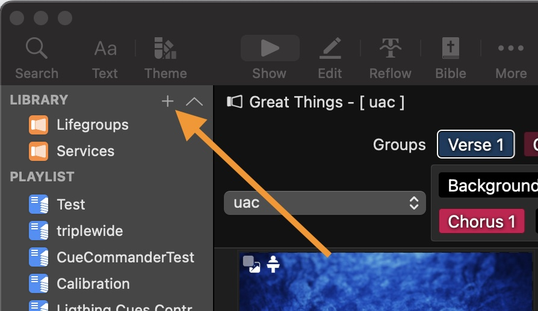
```

Then select "Planning Center Service...". @fig-sop_pco_playlist7_2
 
```{r sop_pco_playlist7_2, fig.pos="H" }
#| label: fig-sop_pco_playlist7_2
#| fig-cap: Select "New PCO Playlist"
#| fig.retina: 2
#| fig-cap-location: bottom

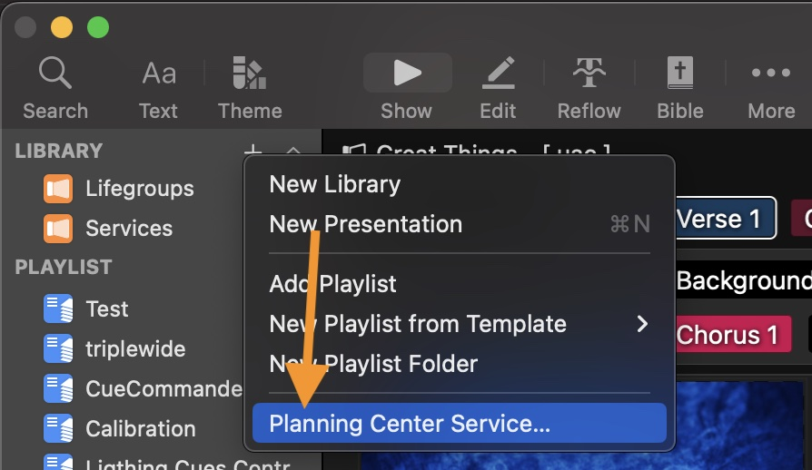
```

Next you will see a pop-up where you need to select the plan that you want to use for your playlist. You may need to scroll sideways to see the date. You may need to click on the grey arrow to see the list of services. @fig-sop_pco_playlist7_3

```{r sop_pco_playlist7_3  }
#| label: fig-sop_pco_playlist7_3
#| fig-cap: Click on the desired date and then "Select"
#| fig.retina: 2
#| fig-cap-location: bottom

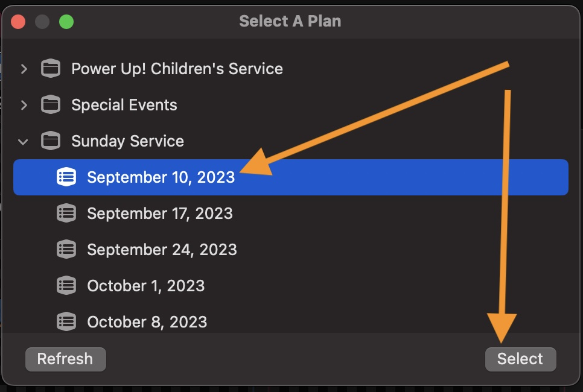
```

The playlist will now show up on the left hand side. If the names of the items in PCO match the names of items that are already in the library, they will be automatically linked to the playlist. If that is incorrect, you can unlink it. 

If a Song is new, you will have to add it. See @sec-songs for more details.

If you created the playlist before Sunday, you should refresh the playlist on Sunday morning to collect any updates. After doing a refresh check to make sure your arrangement choices haven't been changed. @fig-sop_pco_playlist7_4
 
```{r sop_pco_playlist7_4 , fig.pos="H" }
#| label: fig-sop_pco_playlist7_4
#| fig-cap: Refresh a PCO playlist
#| fig.retina: 2
#| fig-cap-location: bottom

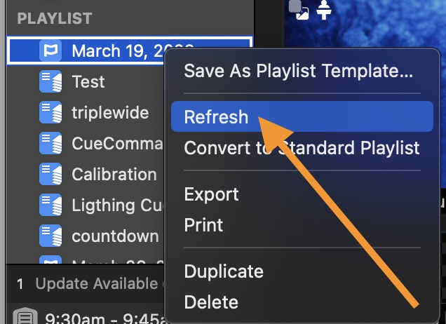
```


A PCO generated playlist remains linked to PCO. Items that were defined in PCO cannot be deleted or re positioned, you can add additional items.

If you need more flexibility, you can convert a PCO playlist to a manual one. @fig-sop_pco_playlist7_5

```{r sop_pco_playlist7_5 }
#| label: fig-sop_pco_playlist7_5
#| fig-cap: Convert to a non-PCO playlist
#| fig.retina: 2
#| fig-cap-location: bottom

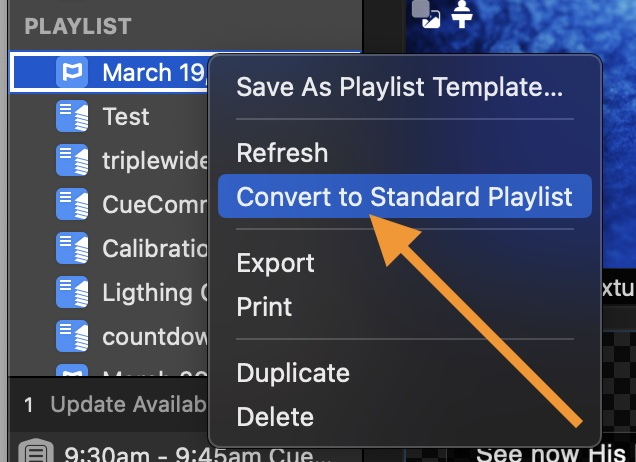
```

## Importing Powerpoint

ProPresenter is able to import the contents of a PowerPoint presentation. It creates a ProPresenter document containing static images, which means any animations and transition affects that were part of the PowerPoint are lost. You also need to ensure that any special fonts used in the PowerPoint are installed on the system prior to importing the presentation.

You execute the import via File \> Import \> Import PowerPoint. @fig-sop-ppt-import-1

```{r sop-ppt-import-1 }
#| label: fig-sop-ppt-import-1
#| fig-cap: Importing a PowerPoint
#| fig.retina: 2
#| fig-cap-location: bottom

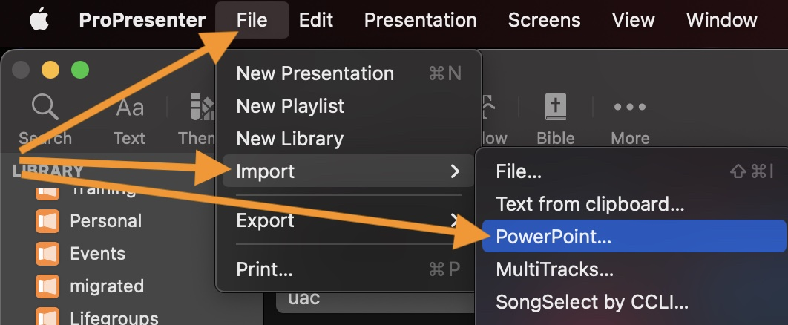
```

and then navigate to the PowerPoint file. @fig-sop-ppt-import-2

```{r sop-ppt-import-2 }
#| label: fig-sop-ppt-import-2
#| fig-cap: Import
#| fig.retina: 2
#| fig-cap-location: bottom

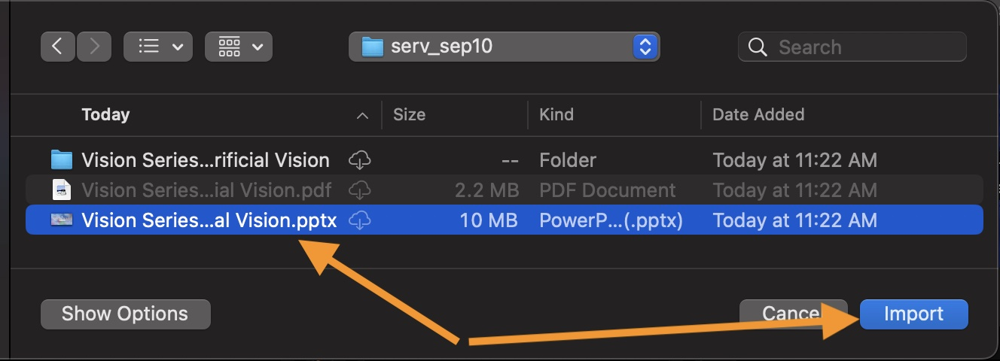
```

Once the import is complete, you can then link the new document to the playlist.
Once positioned in the playlist, ensure that the correct content and lighting cues are set. (See @sec-macros)

Sometimes this import process doesn't work. If it seems to be breaking, then open PowerPoint directly. When you do that, there may be messages from PowerPoint that need attention, like a notice of an update. Once those are cleared, you can retry the import process.

You can also do the PowerPoint Export completely outside of ProPresenter and export all slides as images, create a new ProPresenter document for them, and drag and drop all the saved JPGs into the document. This takes more effort to do, so you would only do it this way if the regular import doesn't work. It is also useful to do when moving a PowerPoint from a different machine and you want to ensure all fonts are rendered correctly.(The export would be performed on the source computer.)

## Video Loop Controls

When adding a video to a presentation, ProPresenter will by default make the video loop. This is good for motion background videos, but not what we want for videos like announcements, bumpers and video feature segments. 

::: {.callout-important}
You need to make sure that the loop property is set correctly. 
:::

How this is to be done depends on how the video was added to the playlist. The two different results are illustrated in @fig-sop-pro7-loop-1

#. if the video was dropped directly onto the playlist on the left, it appears as a small thumbnail with a big play button beside it (first example).
#. if a new presentation was created, and the video was dropped into the presentation, it appears as a big thumbnail (second example).

::: {.callout-tip}
The second method is preferred because you can add macros to the slide which you cannot do with the first method.
:::

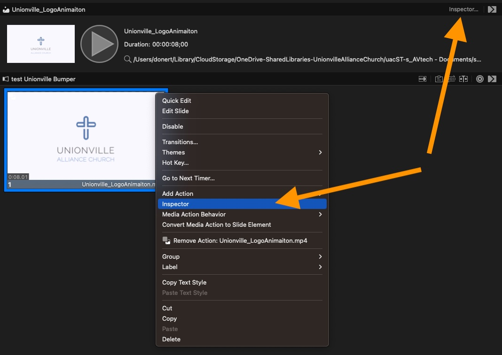{#fig-sop-pro7-loop-1 width=50% }

To change the loop setting, you need to use the *inspector* which is located in different locations depending on the method used. See the orange arrows in @fig-sop-pro7-loop-1 .

On the second tab on the *inspector*, there is a dropdown for *playback*. We need to change that from *loop* to *stop* for a featured video, @fig-sop-pro7-loop-2  
 
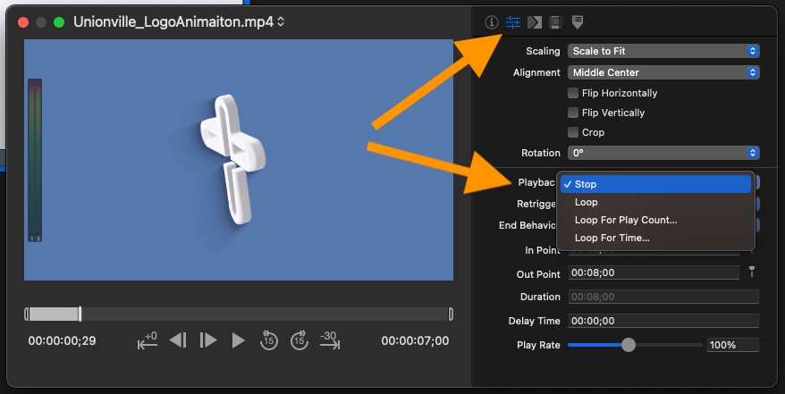{#fig-sop-pro7-loop-2 width=50% }

## Songs {#sec-songs}

The songs needed may be in the library already; the easiest way to link it to your playlist item is to use the magnifying glass on the item itself, or you could use the search at the top of the screen, or ⌘-F. See @fig-sop-pro7-song-search . 

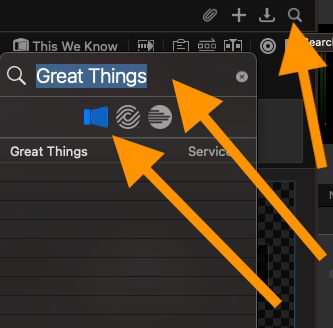{#fig-sop-pro7-song-search width=25%}

Across the top of the search dialogue there are three icons. The left most which looks like the ProPresenter icon directs the search to the local library. The middle icon, which looks like concentric circles direct the search to *SongSelect*, a CCLI service we subscribe to.

In addition to searching by name, you can also search by CCLI song # which is usually found in the PCO song details on the website. If there are many songs with the same title, searching by number can be very helpful.

When adding a new song, there are a few things you should always do:

* Add a blank slide to the beginning and assign it the *group* 'background'. 
* Add a lighting macro to the background slide
* Add a content macro to the background slide
* Add a blank slide to the end of the song and assign it to the *group* 'copyright'.
* Create an arrangement for the song. See [Arrangement Tutorial: https://youtu.be/hW6oTPQLp8c?si=WCdAOMZ31vSnzNwM](https://youtu.be/hW6oTPQLp8c?si=WCdAOMZ31vSnzNwM)
* Use the reflow editor to make all slides 1 or 2 lines long (@fig-sop-pro7-reflow-icon).

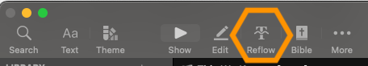{#fig-sop-pro7-reflow-icon}

:::{.callout-tip}
**Tips**

* When breaking lines, pick a spot that makes sense musically
* if there is repetition in the verse format the text which emphasizes that - split the line at the repeat.
* Try to visually balance the line lengths so that all lines on the screen are about the same length - avoid extremes
* Don't break lines so that there is only one word on a line
* Make sure the line breaks look good for both projection and livestream.
:::

## Scripture

:::{.callout-important}
Pay attention to which Bible version is specified on PCO. 
:::

ProPresenter has a tool made specifically for preparing scripture graphics (@fig-sop-pro7-bible-icon). There is a video tutorial on this topic. [Bible tutorial https://renewedvision.com/propresenter/tutorials/#219264](https://renewedvision.com/propresenter/tutorials/#219264)

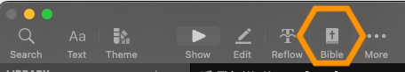{#fig-sop-pro7-bible-icon}

The recommended process after you have formatted the scripture is to use the "Save As" option at the bottom of the screen. Then return to *Show* mode, use ⌘-F and find the scripture you just created and drag that over to the playlist on the left and drop it below the scripture item. The advantage of this is that we minimize the changes to the scripture item that will need to be changed again next week. 

At this point you can edit the scripture verses in the presentation using the *reflow* editor (@fig-sop-pro7-reflow-icon). For scripture we want 3, maybe four lines per verse. Make sure the line breaks look good for both projection and live stream.  

## Displaying Live Video

We have the ability to display the program output of the ATEM video mixer as a slide within ProPresenter. This can be done as a slide within a presentation or as a Prop.

To do this, create a new slide (or Prop) and then add an object to the slide using the white 'Plus' (@fig-sop-add-an-object).

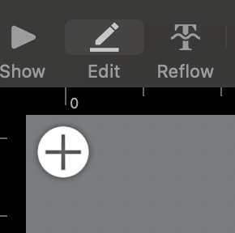{#fig-sop-add-an-object}

From that menu select video input

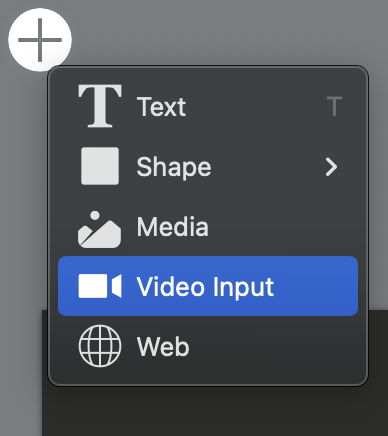

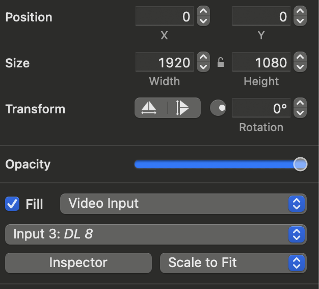

# Themes and Looks

## Themes

A theme is a predefined design template or style that you can apply to your presentations. It includes elements like fonts, colors, backgrounds, and slide layouts. Themes help maintain a consistent and professional look throughout your presentations by ensuring that all slides have a cohesive design. You can easily change or customize themes to match the branding or mood of your event or service.

A theme can be applied to a slide or a selected group of slides using the right-click menu option. 

Many of our *looks* (see @sec-looks) override the theme that is applied on a particular *screen*. When looking at the *look* definition you can see if there is an override by looking at the presentation line, see @fig-sop-pro7-theme-override. You can click on the icon to see which theme is being used for the override.

{#fig-sop-pro7-theme-override}

## Looks {#sec-looks}

*Looks* refer to pre-defined visual settings that you can apply to your content when displaying it on each *screen*. You can think of *Looks* as templates that control the way your content is displayed on different screens (see @sec-screens). 

*Looks* can override the theme that is applied to a presentation for each screen, and also choose which layers are to be displayed. 

Songs are good examples of how we use *Looks*. We apply a theme to the triple wide display to make the lyrics show up on each *output* of that configuration as well as formatting the lyrics as a lower third without the background for the live stream.  

# Stage Display

ProPresenter gives us the ability to display other content on the rear display for the stage team to see that is different from what the audience sees. Since it helps give them confidence, it is sometimes called the confidence display as well.

::: {.callout-tip}
Once a Stage Display Layout is selected, it will not change until you set it to something else. The *Content* macros set the stage display according to the content.
:::

The Stage display layouts can be edited using the "Edit Layouts" option on the "Screens" menu. @fig-sop_stage_layouts

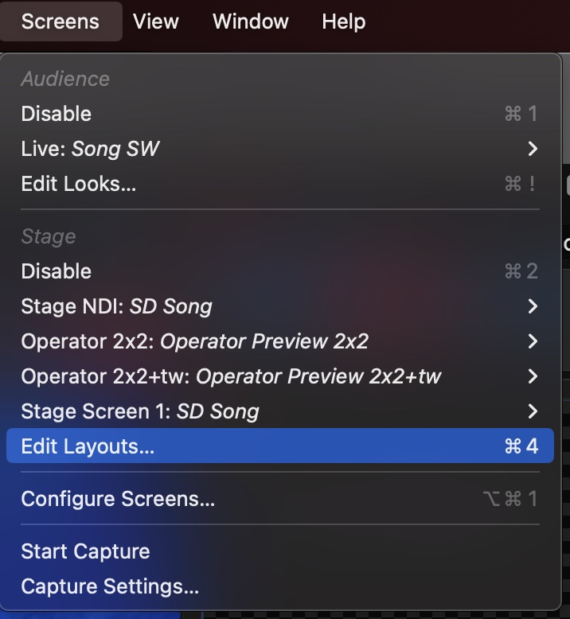{#fig-sop_stage_layouts width=30%} 

## Lyrics on Stage Display Only

We have a dedicated *Content* Macro for this purpose, "*Content Solo*".  Simply drop this macro on the first slide for which you don't want the lyrics to be displayed. This uses a *Look* to turn off the slide layer on all outputs but leave the media layer on. When you want to show lyrics again, using a different *Content* macro, for example *Content Song TW*, will select a different look.  

# Macros {#sec-macros}

Macros provide a way of combining a bunch of actions together to be executed as a group. We have two main types of macros. Macros that provide the settings for a particular type of content (prefix *content*) and another set of macros for lighting cues (prefix *Lq*).

Content Macros

:   These macros set the look and stage display that is most appropriate for the type of content, see @fig-sop_macro_content. The looks may also override the theme applied to the text formatting.

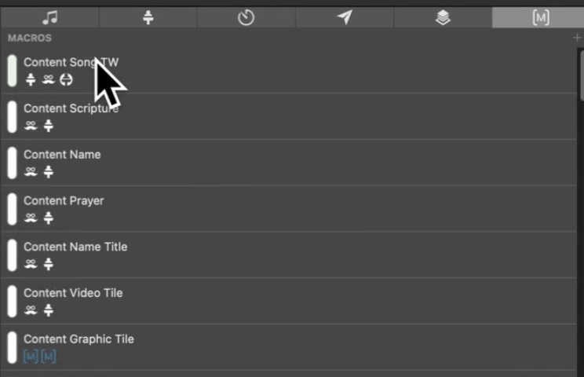{#fig-sop_macro_content  width=50%}

Lighting Macros

: Lighting cues set a prop and the automation program (CueCommanderNR - see @sec-cuecommander) will clear that cue. The lighting cue that is fired is derived from the name of the prop. See @fig-sop_macros_lighting

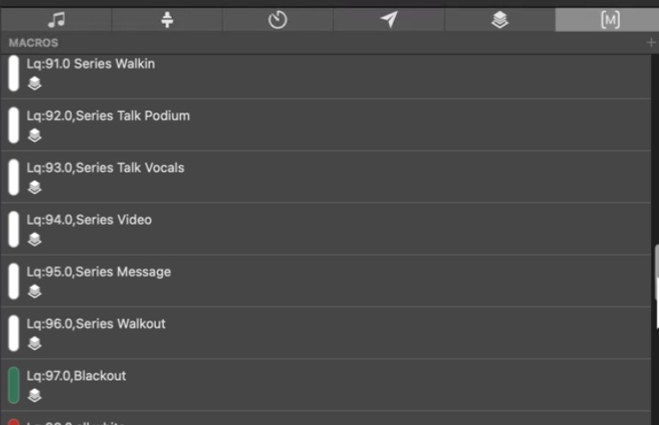{#fig-sop_macros_lighting width=50%}

"Special" Light Cues

: There are 10 predefined macros (and Props) for use as a special. For example, special lighting for a song. These are numbered Lq:80.0 through Lq:89.0. To use them, record your lighting look as the corresponding numbered cue on the lighting console.

Series Standard Lighting Cues

: They are named Lq:90.0 through Lq:99.9. There is a light cue that corresponds to the type of content. Also within this range are **Missions Sunday** versions of the regular series cues; use them on **Missions Sunday**

Colour Themed Light Cues

: Light cues Lq:100.0 through Lq:899.9 are reserved for light cues that correspond to different colour combinations, suitable to accompany music. The numbers correspond to major colours, see @tbl-digit-convention.

```{r}
#| tbl-cap: "Cue Name Digit Convention"
#| tbl-cap-location: bottom
#| label: tbl-digit-convention

tribble(
	~Digit, ~Colour,
	1, "Red",
	2, "Green",
	3, "Blue",
	4, "Yellow",
	5, "Cyan",
	6, "Magenta/Pink",
	7, "White",
	8, "Orange/Amber"
) |>
	gt() |>
	opt_stylize(style=3) |>
	tab_style( style = list( cell_fill(color = "red") ),
    locations = cells_body(  columns = "Digit" , rows = Digit == 1) ) |>
	tab_style( style = list( cell_fill(color = "green") ),
    locations = cells_body(  columns = "Digit" , rows = Digit == 2) ) |>
	tab_style( style = list( cell_fill(color = "blue") ),
    locations = cells_body(  columns = "Digit" , rows = Digit == 3) ) |>
	tab_style( style = list( cell_fill(color = "yellow") ),
    locations = cells_body(  columns = "Digit" , rows = Digit == 4) ) |>
	tab_style( style = list( cell_fill(color = "cyan") ),
    locations = cells_body(  columns = "Digit" , rows = Digit == 5) ) |>
	tab_style( style = list( cell_fill(color = "magenta") ),
    locations = cells_body(  columns = "Digit" , rows = Digit == 6) ) |>
	tab_style( style = list( cell_fill(color = "white") ),
    locations = cells_body(  columns = "Digit" , rows = Digit == 7) ) |>
	tab_style( style = list( cell_fill(color = "orange") ),
    locations = cells_body(  columns = "Digit" , rows = Digit == 8) ) |>
	tab_style( style = list(  cell_text(weight = "bold") ),
    locations = cells_body(  columns = "Digit",  rows = everything() ) )
```

A light cue of Lq:140.0 would be defined to have a main colour of red (#1) and a secondary colour of yellow (#4). For more details, see the **System Operations Lighting** guide.

# How We Organize our files

## OneDrive service_media

The service_media directory contains the short term content and provide a means for content creators to contribute content remotely. There are three main directory types that will be found here and they follow a name pattern:

Week Specific (eg. serv_feb12)

:   Within 'service_media' there would be a folder like serv_feb12. This is used for content that is specific to that date only. The powerpoint for the date, Announcement videos for that date, etc. Anything placed in those folders should be considered delete-able after the event has finished. If it is to be reused for a few weeks, it should be copied to the appropriate weeks, or placed in the series folder.

media_assets

:   This directory holds content meant to be reused long term. This includes things like uac logos and branding files.
Series Folder (Eg. series_jesus)

:   This is for graphics and media which are to be used for an entire message series. It contains the centre screen graphic, the lower 3rd graphics for video, the series Welcome graphic, bumper video, plus other useful backgrounds.

When we start a new series, we need to update several things in ProPresenter:

* "Welcome" document
* "Series Graphic" in "Props"
* "Bumper"
* Update the colours on the name and name+title themes and looks
* Also, on the lighting console, re-record the series cues (90.0-99.9) for the series  (don't change the **Missions Sunday** cues).

## Media Resources

This is our main graphic library, for both still and motion graphics. There are some folders which are organized by a particular graphical theme (eq baptisms). And others which are organized by the source from which it was downloaded.

Many files have keywords in the file names that make them easier to search for. For example, you can search

-   by colour, eg "red",
-   or by content, eg "cross",
-   or format, eg "tw" for triplewide content.

There are two main locations to look for graphics:

#. "CMG Graphics". These have all been downloaded from http://churchmotiongraphics.com . You can also go to that website and browse for something specific.
#. "Procontent" - these have been downloaded from https://procontent.renewedvision.com . You can also go there to browse. 

# Screens {#sec-screens}

```{r get_defs}
scr <- get.glossary() |>
	filter(Topic == "ProPresenter7" & Term == 'Screen' )  
opt <- get.glossary() |>
	filter(Topic == "ProPresenter7" & Term == 'Output' ) 
```


We need to start with some definitions:

Screen
: `r scr$Definition`

Output
: `r opt$Definition`

We have several *output*s which are obvious. The three projection displays at the front are each an *output*, as is the stage display at the rear. We have a few more that are not so obvious: the Key+Fill video we send to the video matrix, a single wide version of the front display, and a copy of the stage display which we send to the live stream audio engineer. 

Most of those *output*s are linked to a single *screen*. The front projection displays are more complex and are described next in @sec-running-tw.  

## Running Triple Wide {#sec-running-tw}

The ProPresenter projection output is a triple wide configuration. That is three HD images (1920x1080) side by side for a total of 5760x1080 pixels. ProPresenter knows that the projected image is divided up into three projection outputs. 
 
Our Front three projectors are each separate *Output*s. They are then used to define two different *Screen*s:

TW_Group
: A *Screen* which groups the three *Output*s into a large horizontal canvas across which images and videos span. See @fig-sop-pro7-tw-group for how it is defined and  @fig-tw-group-abc for an illustration of a possible display.

TW_Mirror
: A *Screen* which defines the three *Output*s as displays which are each to show identical content. See @fig-sop-pro7-tw-mirror for how it is defined and  @fig-tw-mirror-aaa for an illustration of a possible display.

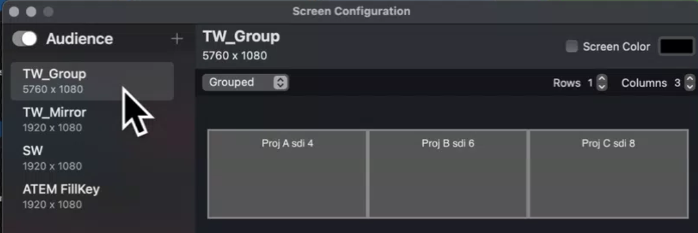{#fig-sop-pro7-tw-group width=50%}

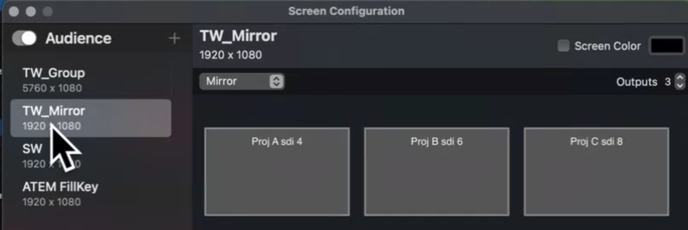{#fig-sop-pro7-tw-mirror  width=50%}

Looks (@sec-looks) are used to control which *Screen* is sent to the *output*. 

:::{.callout-note}
If both *screen*s are sent content at the same time it can look weird.

If two (or more) *screen*s map to the same *output* and the active *look* enables the same *layer*, then you can see odd formatting. For example, multiple copies of the same or similar content appearing on a display. 

The most common result would be doubled copies of the lyrics or a narrow triple wide image on top of a single wide image. 
:::

Examples of *Group* versus *Mirror* displays:

{#fig-tw-group-abc}

{#fig-tw-mirror-aaa}

# Projectors and TVs

## Power

The Stream Deck at the ProPresenter desk (2605-2504) is the primary way to turn the projectors and TVs on and off. From the *Main Menu* choose *ProP Menu* then *Power Control* (@fig-sd-power).

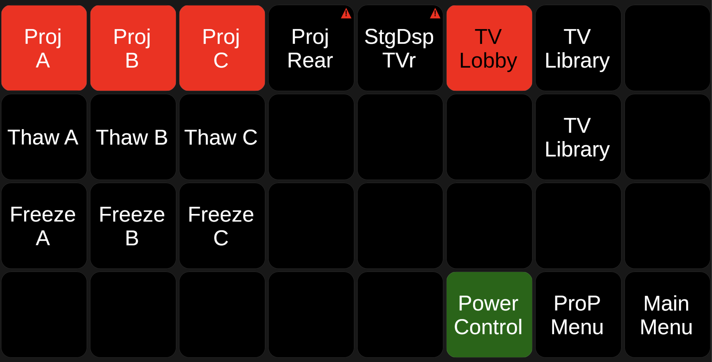{#fig-sd-power width="90%"}

Proj A / B / C

:   The three front projectors. A button is **red when the projector is off** and **green when it is on**. Press it to change state; it takes some seconds for the colour to change while the projector warms up or cools down.

TV Lobby

:   Red when off, green when on. Pressing it changes state and also forces the TV input to HDMI 1.

TV Library

:   Power for the library TV.

Proj Rear / StgDsp TVr

:   Not currently working from the Stream Deck (the warning marker on the button). Use the remotes described below.

Freeze / Thaw A, B, C

:   *Freeze* holds whatever image is on that projector until the matching *Thaw* is pressed. Useful when you need to do something disruptive with ProPresenter, e.g. a computer restart. The button cannot show whether a projector is currently frozen.

**Fallbacks**

-   Each front projector has a web page (bookmarked in Safari on the ProPresenter computer) from which it can be powered on and off.
-   If a projector does not respond over the network, use the grey Sony remote control. Stand below the screen and point the remote at the projector. The selector switch on the remote needs to be set to **A** for the east screen, **B** for the centre screen, and **C** for the west screen.
-   The remote (Hitachi) for the balcony rear projector (the confidence projector) is found near the computer monitor. To power off this projector you need to hit the off button **twice**.

## Projector Inputs

Each front projector has two feeds: **Input C** (HDMI, from the VideoHub via a converter at the projector) is the normal one, and **Input D** (HDBaseT, from the VS-88DT matrix) is a fallback. Input D is also the one to use for HDCP-protected (copyrighted) material, which the normal path will not pass. The input is selected on the projector's remote or web page.

# Video Routing

The VideoHub video matrix decides which source each projector and TV shows. It is normally left on its default routing (the triple wide outputs to projectors A, B and C, and the ATEM program to the TVs). For special situations use the presets on the **video desk** Stream Deck: *Main Menu* > *Video Menu* > *VideoHub*.

```{r}
#| label: tbl-sd-videohub
#| tbl-cap: Stream Deck VideoHub Presets
tribble(
	~Preset, ~`Use it when`,
	"Normal Projectors", "You want to get back to normal - triple wide on all three projectors. Press this when any of the others is no longer needed.",
	"Baptism", "A baptism is happening.",
	"Pgm to B", "You want live camera on the centre screen. Whatever the video operator puts on the ATEM program will be shown on projector B; A and C stay on triple wide.",
	"Pgm to A & C", "You want live camera on the two side screens.",
	"ProP HDMI to ABC", "You want the ProPresenter computer's HDMI output on all three projectors - e.g. a DVD, a PowerPoint run directly, or a web page. This bypasses the DeckLink."
) |>
	gt() |>
	opt_stylize(style = 3)
```

::: {.callout-important}
Always press **Normal Projectors** when the special routing is no longer needed.
:::

::: {.callout-note}
The older Kramer VS-88DT matrix still carries the HDBaseT feeds to the lobby, nursery and rear projector, and the fallback feed to the front projectors. It is not normally touched. If it is ever needed, it has a web page (bookmarked in Safari) and front panel OUT/IN buttons; the unit is located under the desk near the computer.
:::

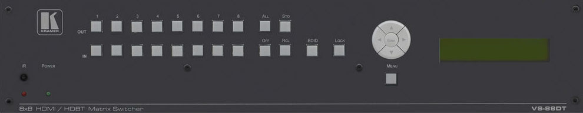{width=50%}

# Remote Login

Rather than having to come to the church to prepare the playlist, we have the ability to log in to the ProPresenter computer (CUMU-G002) remotely. More than one person can do this at the same time, which allows two people to see exactly the same thing and work together - this is helpful for training or assistance.

1.  In a web browser go to <https://neysh.screenconnect.com/>.
2.  Log in with the userid and password you have been given separately. Please do your best to protect this password from being compromised.
3.  Select the **CUMU-G002** host from the access list and join the session. The first time you connect you will be prompted to install the ScreenConnect client for your computer.
4.  Once connected you will see all the displays that the computer has configured. Use the view menu to select the primary display so you have a decent screen size to work with.

::: {.callout-note}
TODO: add screenshots of the ScreenConnect login and host selection.
:::

<!--
#sec-cuecommander is defined in the include. 
-->



# Trouble Shooting

## Filter needs cleaning

Please advise Terry.

## Video mixer (ATEM) sees only a black image for the ProPresenter input

The problem:

-   The computer was woken before the ATEM was fully powered on. 

Recovery:

-   Option A (least disruptive): quit ProPresenter, open the Mac's display settings on CUMU-G002, change the resolution to something else and then back again. The Mac video system will reset; the projectors will flicker as they resync. Restart ProPresenter.
-   Option B: reboot the Mac (CUMU-G002).

## Projectors don't respond to the Stream Deck or web page (to turn on or off)

The problem:

-   Network trouble, or Companion is not running on CUMU-G001 (the Stream Deck buttons will be blank).

Recovery:

-   Try the projector's web page from the ProPresenter computer.
-   Otherwise use the grey Sony remote control. Stand directly below each projection screen and point the remote at the projector. One remote does all three; set the selector switch to **A** (east), **B** (centre) or **C** (west).

# Appendix

## Terminology

```{r}
# A hack - gt doesn't provide a means of line-breaking for pdf. So we create a graphic and then include the graphic.

tab <- get.glossary() |>
	filter(Topic == "ProPresenter7" | Term == 'Bumper' | Topic == "General") |>
	select(Term, Definition, Topic) |>
	arrange(Topic, Term) |>
    gt(groupname_col = "Topic") |>
	opt_stylize(style=3) |>
	fmt_markdown(columns=Definition) |>
	tab_style(
  style = cell_text(weight = "bold", size="large"),
  locations = cells_row_groups()
)
```

```{r glossary, results='asis'}
cat(print_gt_table(tab))
```


