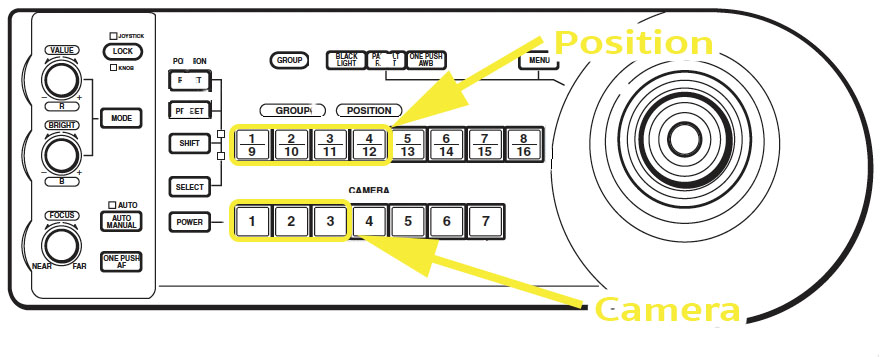
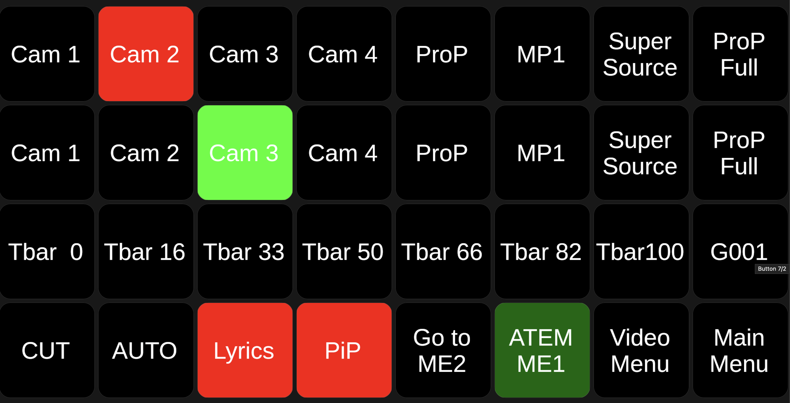
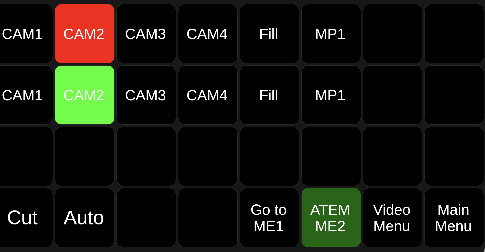
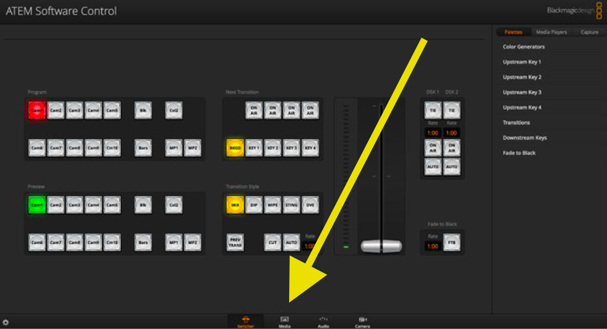
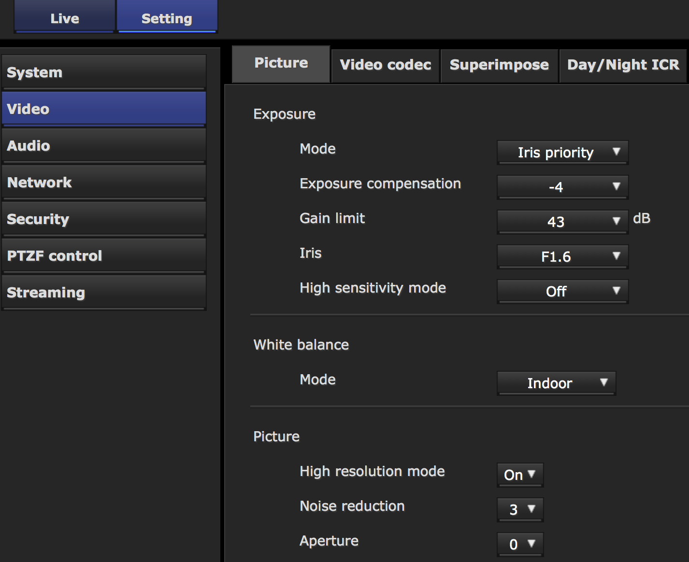
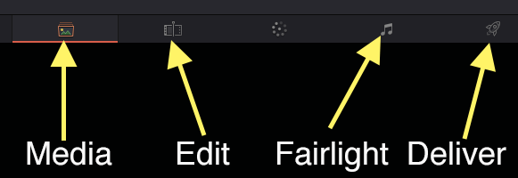
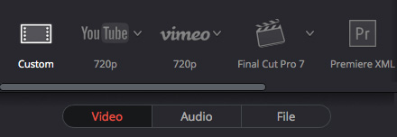
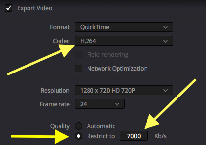
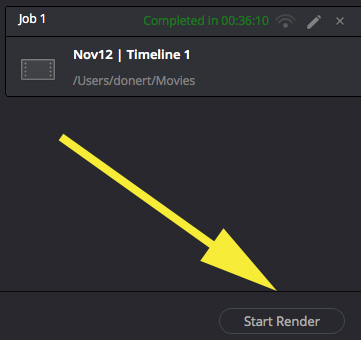

```{r packages }
source("./commonPackages.R")
```

```{r functions}
source("./commonFunctions.R")
source("./commonDiagram.R")
```

```{r data}
db.network <- get.network()
further      <- get.further()
db.cables       <- get.cables()
db.assets       <- get.assets()
```

# Introduction

This document provides basic operating information for Video Mixing at Unionville Alliance Church.
We do this for several purposes

1.  

    In-house Inclusion

    :   We 'broadcast' our mix content internally to the lobby, nursery and toddler rooms, so that those who can't be in the main sanctuary can participate in those locations.

2.  

    Recording for the Web site

    :   We record the message and post that as quickly as possible to the web site so that those who may wish to watch the content later can do so.

3.  

    Image Magnification

    :   There are times when we want to make small things large.
        Maybe Pastor has an artifact in hand that he would like everyone to see, or we have something on stage that we need to be featured - like a baptism.
        We have the capability to use our cameras to grab the 'image' and routed it to the one or more projectors.

4.  

    Livestreaming

    :   We stream our services to FaceBook Live, Youtube Live and Church Online Platform.

# Turning it on and off

The video mixer, VideoHub and Stream Deck will usually have been turned on by the audio engineer. If by chance the ProPresenter computer was woken before the video mixer, you will not see its video feed. See the troubleshooting section for corrective steps.

Main Power

:   On - Flip the switch at the top of the tabletop rack - labelled "Power Switch #4".

:   Off - Flip the same switch the other way.

Stream Deck

:   The Stream Deck at the video desk (2603-1301) is driven by the *Companion* software running on the video computer (CUMU-G001). It only works while **avuser is logged in** on that computer. If the buttons are blank or unresponsive, log in on CUMU-G001 and check that Companion is running.

Cameras

:   Both On and OFF are handled by the RMIP10 camera control panel.
    Hold down the Power Button (beside the big "1" button) and press/release each of the "1", "2", and "3" buttons.
    This will wake the cameras up.
    It takes about 30 seconds for an image to appear.

::: callout-note
<small>As we currently operate things, the cameras are 'on' all the time but 'asleep'.
To turn them off completely we have to unplug their power source.
If this has been done you may need to plug them in.
On - there are three ethernet jacks that need to be plugged into the cisco switch (NSCU-A004) so that the cameras can get power.
Off - Unplug those same three jacks.
There is a little plastic tab that needs to be depressed to release the jack.
Be gentle.</small>
:::

::: callout-note
TODO: Which jacks are the correct network jacks
:::

# Operating Remote Cameras via the Joystick

The RMIP10 joystick (Asset Tag ZVKU-A004) remote control allows a single person to operate three cameras quite easily.

To adjust a camera position, select the number of the camera you want to adjust on the bottom row (1, 2, or 3) and then either select a preset or move the joystick.
left, right, up and down movements follow the joy stick movement.
Zoom is accomplished by turning the ring on the top of the joy stick.

You can adjust the brightness and focus using the adjustment knobs on the left side.
To adjust the focus you have to push the "Auto/Manual" button to go into manual mode.

We have presets assigned which are programmed to bring a camera to specific positions quickly.
We have created some standard presets which enable simple operation for many basic situations.
All three cameras share these same presets, but since they are positioned in different locations they still provide different perspectives.

The middle row of buttons will be typically used to direct a camera to a preset position.

{width="75%"}

1.  

    Teaching Tight

    :   Head and shoulders on the standard teaching spot.

2.  

    Teaching Medium

    :   Waist up on the standard teaching spot.

3.  

    Teaching Wide

    :   Full body about 3 meters wide.
        Good for a change in perspective and for when the pastor is moving around a lot.

4.  

    Whole Stage

    :   As you might expect - the whole stage from edge to edge.

5.  

    Worship Leader Tight

    :   The Worship leader is normally in the centre front of the stage.
        This head and shoulder shot might need some tweaking when used as position week over week may not be consistent.

6.  

    Worship Team Wide

    :   The whole team of 6 or so singers.
        When used you may need to go wider or narrower depending on the vocal complement of that week.

Presets 7 and 8 are available for your ad-hoc usage.

::: callout-note
Recalling a preset recalls all settings which may cause an unintended colour or brightness shift.
:::

The Stream Deck also has a page per camera (*Video Menu* > *Camera 1/2/3*) with PTZ, focus, colour and brightness controls.

# Video System Overview

The video system has four main parts. Understanding how they fit together makes the rest of this document easier to follow.

VideoHub (2507-0700)

:   A 40x40 SDI video matrix. Every video source in the building (cameras, ProPresenter outputs, the video mixer's own outputs) goes *into* the VideoHub, and every destination (video mixer inputs, projectors, recorders, the Resi encoder, TVs, monitors) is fed *from* it. Which input goes to which output is a "route". The routes are normally left at their defaults; a few presets on the Stream Deck change them for special events.

ATEM Constellation 2ME (2601-2800)

:   The video mixer. It has two mix/effects engines: **ME1** produces the program that is recorded and streamed; **ME2** is used mainly as a camera selector for the SuperSource box on ME1. It also provides the keyers used for the lyric overlay and the picture-in-picture.

Stream Deck (2603-1301)

:   The primary operator control. It talks to the ATEM, the VideoHub, the recorders and the cameras via the *Companion* software on CUMU-G001. Almost everything in this document is done from here.

ATEM Software Control (on CUMU-G001)

:   Blackmagic's control application. Used when something is needed that the Stream Deck doesn't expose - loading media into the media players, adjusting keyer or SuperSource settings, or editing macros.

## Video Mixer Inputs

All twelve ATEM inputs are fed from the VideoHub. @tbl-atem-input-map shows, for each ATEM input, the VideoHub output that feeds it, the VideoHub input that is routed to that output by default, and the actual source. The table is generated from the cabling database.

```{r atem-input-map}
#| label: tbl-atem-input-map
#| tbl-cap: ATEM Inputs and their Sources (via the VideoHub)
hub  <- "2507-0700"
atem <- "2601-2800"
xpt <- db.cables |> filter(SrcTag == hub, DstTag == hub) |>
	select(hub_in = SrcPort, hub_out = DstPort)
vin <- db.cables |> filter(DstTag == hub, SrcTag != hub | is.na(SrcTag), grepl("^in_", DstPort)) |>
	select(SrcTag, SrcPort, hub_in = DstPort, Usage)
vout <- db.cables |> filter(SrcTag == hub, DstTag == atem, grepl("^out_", SrcPort)) |>
	select(hub_out = SrcPort, atem_in = DstPort)

vout |>
	left_join(xpt, by = "hub_out", relationship = "many-to-many") |>
	left_join(vin, by = "hub_in", relationship = "many-to-many") |>
	left_join(db.assets |> select(AssetTag, Desc), by = c("SrcTag" = "AssetTag")) |>
	distinct(atem_in, hub_out, hub_in, SrcTag, Desc, Usage) |>
	arrange(atem_in) |>
	gt() |>
	opt_stylize(style = 3) |>
	cols_label(atem_in = "ATEM In", hub_out = "VideoHub Out", hub_in = "VideoHub In",
			   SrcTag = "Source", Desc = "Source Description") |>
	sub_missing(missing_text = "-")
```

The sources as they appear on the Stream Deck:

```{r}
#| label: tbl-atem-sources
#| tbl-cap: Stream Deck Source Buttons
tribble(
	~Button, ~ATEM.Input, ~Description,
	"Cam 1", "1", "PTZ camera, east (ZVCU-A001)",
	"Cam 2", "2", "PTZ camera, centre (ZVCU-A002)",
	"Cam 3", "3", "PTZ camera, west (ZVCU-A003)",
	"Cam 4", "4", "Stage camera via the BNC patch panel",
	"ProP", "11 (fill) + 12 (key)", "ProPresenter fill and key - the lyric/graphic layer, keyed over a camera",
	"ProP Full", "9", "ProPresenter's independent full-screen output (\"PP SW\")",
	"MP1", "Media Player 1", "Still graphic or short clip loaded via the ATEM software",
	"Super Source", "SuperSource", "ME2's program (normally a camera) in a box beside the ProPresenter output",
	"G001", "-", "Video from the video computer CUMU-G001 (e.g. Zoom)"
) |>
	gt() |>
	opt_stylize(style = 3) |>
	cols_label(ATEM.Input = "ATEM Input")
```

## Video Mixer Outputs

ATEM output 1 (ME1 program) goes back into the VideoHub (input 10) and from there is routed to the recorders, the Resi encoder, the Web Presenter, the NDI converter and the lobby/nursery TVs. The multiview outputs feed the broadcast monitors. See @tbl-atem-outputs.

```{r tbl-atem-outputs}
#| tbl-cap: ATEM Outputs
#| tbl-cap-location: bottom
#| label: tbl-atem-outputs

db.cables |> 
	filter(SrcTag == "2601-2800") |> 
	select(SrcPort, Usage, DstTag, DstPort) |> 
	arrange(SrcPort) |> 
	gt() |>
	opt_stylize(style=3) |>
	cols_label( SrcPort = "Output Port",
				DstTag  = "Destination",
				DstPort = "Destination Port")  
```

## How Alpha Keying Works

Alpha keying is an essential technique in video production.
It allows us to superimpose people, objects, or animations onto our camera images easily, creating amazing scenes and adding a touch of magic to our broadcasts.

Our system is setup to allow us to use alpha keying.
ProPresenter sends two video signals (key and fill) which allow text, graphic or video content to partially overlay the camera image.

This is how it works.
Imagine you have two pictures, but they are a bit special.
One is the "key" picture, and the other is the "fill" picture.
These are in addition to the selected camera image which will be the background image.

Fill Picture

:   This is the text or graphic from ProPresenter which we want to show on top of the camera image.
    Parts of this image that will show through the transparent parts of the key picture.

Key Picture

:   This picture is a bit different from 'normal'.
    It has a special hidden superpower called an "alpha channel" or "transparency information." It's like a hidden code behind the picture that tells the video mixer which parts are see-through and which parts are solid.
    It is represented by a gray scale image, where white means fully solid (the camera will be hidden) and black means fully transparent (the camera will be revealed).

Now, here's how the alpha keying works:

Understanding Alpha Channel: The video mixer looks at the key picture and checks its alpha channel.
It sees the different levels of transparency represented by shades of gray.
Combining the Pictures: The video mixer then takes the fill picture and the key picture with its alpha channel and cleverly blends them together.
It uses the transparency information from the key picture to know where to make it see-through and let the fill picture show through.

Result: As a result, you see the key picture with its transparent parts combined seamlessly with the fill picture.
The person or object from the key picture appears on top of the background from the fill picture, and it looks like they are really there!

::: callout-note
TODO: Add example pictures
:::

# Operating the Switcher from the Stream Deck

## Menu Structure

The three buttons in the lower right corner of every page are for navigation: the very corner button is **Main Menu**, the one to its left is the sub-menu (**Video Menu** on the pages below), and the one to the left of that shows the current page name and does nothing when pressed. The video-related pages are:

```{r}
#| label: tbl-sd-video-pages
#| tbl-cap: Stream Deck Video Menu Pages
tribble(
	~Page, ~Purpose,
	"ATEM ME1", "The main switching page - program/preview selection, transitions, lyrics and PiP",
	"ATEM ME2", "Program/preview selection for ME2, which feeds the SuperSource box",
	"VideoHub", "Routing presets: Normal Projectors, Baptism, Pgm to B, Pgm to A & C, ProP HDMI to ABC",
	"Camera 1 / 2 / 3", "PTZ, focus, colour and brightness for each camera",
	"ATEM Macros", "Pre Service, Start Service, Start Message, Stop Service, Stop Message, Kaleo Bug",
	"Record Control", "Rec, Stop, Play, Prev/Next Clip, Format Prepare/Confirm for the HyperDeck recorders"
) |>
	gt() |>
	opt_stylize(style = 3)
```

## The ME1 Page

This is where you will spend most of the service. See @fig-sd-me1.

{#fig-sd-me1 width="90%"}

Row 1 - Program

:   The source that is currently **live**. The live button is lit red. Pressing a button on this row cuts it straight to air - the same as selecting it on Preview and pressing CUT.

Row 2 - Preview

:   The source that will go live on the **next transition**. The selected button is lit green. This is the normal way to line up your next shot.

Row 3 - T-bar

:   **Tbar 0 ... Tbar 100** set the transition bar to that percentage. Stepping through them gives a manual fade with full control over speed; Tbar 100 completes the transition. **G001** is the video from the video computer (CUMU-G001), used for Zoom and similar.

Row 4 - Transitions and keyers

:   **CUT** takes the preview source to air instantly. **AUTO** takes it to air using the configured transition (normally a mix). **Lyrics** toggles the lyric overlay (see below); **PiP** toggles the picture-in-picture box. Both light red when on. **Go to ME2** jumps to the ME2 page.

::: callout-tip
Lyrics and PiP are *toggles*. A red button means the layer is currently on air. If you see red when you don't expect it, press the button to clear it.
:::

## Basic Switching

-   Decide which source you want to change to.
-   Press its button on the **Preview** row (it turns green).
-   Verify the shot on the preview window of the multiview monitor.
-   Press **AUTO** for a mix, or **CUT** for an instantaneous change.

## Lyrics Overlay

The **Lyrics** button turns on a downstream keyer that overlays the ProPresenter fill (ATEM input 11), shaped by the ProPresenter key (input 12), on top of whatever is on program. Because it is a downstream key it sits over everything, including SuperSource and PiP. Press again to remove it. The mechanics of the fill/key pair are described in the alpha keying section above.

## Picture in Picture

The **PiP** button turns on an upstream keyer that places the ProPresenter output in a box over the live camera. Press again to remove it. Use it when a slide needs to be seen alongside the speaker rather than replacing them.

::: callout-note
The position and size of the PiP box are set in the ATEM software. They are not adjusted from the Stream Deck.
:::

## SuperSource

**Super Source** is a composed picture: the ME2 program (normally a camera) in a box alongside the ProPresenter output. To use it:

1.  Press **Go to ME2** and select the camera you want in the box (Preview then CUT/AUTO, or straight on the Program row). See @fig-sd-me2.
2.  Press **Go to ME1**.
3.  Select **Super Source** on Preview and take it with AUTO or CUT.

{#fig-sd-me2 width="90%"}

The ME2 page has the same Program/Preview/Cut/Auto layout as ME1 but only the sources that make sense in the box: the four cameras, the ProPresenter **Fill** and **MP1**. The SuperSource layout itself is fixed and is not currently modified during services.

## ProP vs ProP Full

**ProP** is the ProPresenter fill/key pair - the layer designed to be keyed over a camera. Selecting it on program shows the fill on its own. **ProP Full** is an independent full-screen ProPresenter output and is the right choice when you want the slides to fill the frame (e.g. a video played from ProPresenter).

## VideoHub Presets

The *VideoHub* page changes the matrix routing for special situations:

```{r}
#| label: tbl-sd-videohub
#| tbl-cap: Stream Deck VideoHub Presets
tribble(
	~Button, ~Effect,
	"Normal Projectors", "Resets the projectors to the standard routing. Use this to get back to normal after any of the others.",
	"Baptism", "Routing configuration for a baptism.",
	"Pgm to B", "Sends the ATEM program to the centre projector (B) only.",
	"Pgm to A & C", "Sends the ATEM program to the two side projectors (A and C).",
	"ProP HDMI to ABC", "Sends the direct ProPresenter HDMI output to all three front projectors."
) |>
	gt() |>
	opt_stylize(style = 3)
```

::: callout-important
Always return to **Normal Projectors** when the special routing is no longer needed.
:::

## ATEM Macros

A macro is a recorded sequence of switcher actions that runs at the press of a button, so that a complex set of steps is done quickly and without error. The service macros are on the Stream Deck *ATEM Macros* page:

```{r}
#| label: tbl-sd-macros
#| tbl-cap: Service Macros
tribble(
	~Macro, ~Purpose,
	"Pre Service", "Pre-service setup of keyers and media players",
	"Start Service", "Start of service actions, including starting the recorders",
	"Start Message", "Start of message actions, including the message recording and title graphics",
	"Stop Message", "End of message actions, including the trailer and stopping the message recording",
	"Stop Service", "End of service actions, including stopping the recorders",
	"Kaleo Bug", "Shows the Kaleo logo on screen for 120 seconds, then hides it"
) |>
	gt() |>
	opt_stylize(style = 3)
```

Macros can also be run, edited and recorded from the ATEM software on CUMU-G001: open the *Macros* window, choose the **Run** tab and **Recall and Run**, then click the macro name.

::: callout-note
TODO: document the exact steps recorded in each macro on the Constellation.
:::

## Using the ATEM Software

The ATEM Software Control application on CUMU-G001 mirrors the whole switcher. Use it when you need to:

-   load graphics or clips into the media players (see below),
-   adjust keyer settings (lyric key clip/gain, PiP position),
-   change the SuperSource layout,
-   edit macros, or
-   recover when the Stream Deck is unavailable - everything on the ME1 page can be done from the *Switcher* tab.

## Using the Built-in Media Player

The ATEM mixer has built-in media players which can play images and very short videos.
Using them has three steps:

1.  Loading the content into the mixer
    -   This is most easily done using the ATEM control software on the VideoMac (CUMU-G001). Go into the Media tab and navigate to the file you want to transfer and then drag n' drop it into the media bin.
    -   You can get rid of old media by simply clicking on the 'X' in the corner of the media item.
2.  Assigning a media element (image or video) to a player. Two ways to do this
    -   Using the ATEM software, media tab as above. You can drag n' drop media from the bin to the player of your choice on the right hand side.
    -   Using the ATEM console itself, you can navigate to the media player menus and select the item you want by file name.
3.  Using the player as a source
    -   Media Player 1 is available as **MP1** on the Stream Deck ME1 and ME2 pages, on both the Program and Preview rows.

## Usage of media players

The built-in media players can be used to playback static graphics or very short videos.
The graphics are changed using the ATEM control software on the Mac (CUMU-G001):

-   On the bottom of the screen there are four tabs: Switcher, Media, Audio, Camera, select the "Media" tab, as shown in @fig-mediatablocation.

{#fig-mediatablocation}

-   On the left hand side there is a file navigator. Dropbox will be one of the "Favourites". Expand it by clicking on the "\>".
-   Navigate to the folder for the week, eg "serv_aug25"

::: callout-note
TODO: take a screenshot of the media tab, with the favourites expanded.
:::

::: callout-note
TODO: take a screenshot of the tiles where the lower third should be dropped.
:::

# Operating the Video Recorders {#sec-record-control}

We have two solid state recorders, Black Magic Design Hyperdeck Minis (Asset Tags ZVRU-A001 and ZVRU-A002).
These record onto SD memory cards. Both are fed the ATEM program from the VideoHub.
You can observe and verify what is being recorded by looking at the mini screens on the device.

The normal way to control them is the Stream Deck *Record Control* page, which has **● Rec**, **■ Stop**, **▶ Play**, **Prev Clip** / **Next Clip** and **Format Prepare** / **Format Confirm** buttons for each deck. The front-panel controls described below do the same thing.
If the screen is black you may want to record a few seconds and then stop recording to ensure things are correctly initialized.

> Ensure that the destination cards have been formatted before you begin recording.
> See below.

To start recording

:   Press the white dot button, it will turn red while recording.

To stop recording

:   Press the white square

> The Stream Deck *Record Control* page and the *ATEM Macros* page ("Start Service", "Stop Service", "Start Message", "Stop Message") can do the same thing - see @sec-record-control.

The screen will display the amount of time the recording has been going for.
If the counter turns red then not much time is left on the cards.
The amount of recording time should be checked well before the beginning of service.

### Formatting a card

The Stream Deck *Record Control* page has **Format Prepare** and **Format Confirm** buttons which must be pressed in that order. To format from the HyperDeck itself:

1.  Insert the media you want to format in the SD card slot.
2.  Press the 'menu' button on the control panel.
3.  Turn the jog wheel and use the set button to enter the 'record' menu on the LCD display and select 'format card'.
4.  Select the SD card you want to format on the LCD using the jog wheel. Press the 'set' button to confirm your selection.
5.  Now pick the desired format, in our case 'HFS+'.
6.  A Warning message will appear asking you to confirm the choice. Confirm by selecting 'format' with the wheel and then pressing the 'set' button.
7.  A progress bar will show the progress. When complete the message 'formatting complete' will be displayed. Press the 'set' button again to return to the menu.

::: callout-tip
You can also navigate using the arrow keys rather than the jog wheel.
:::

# Operating Web Presenter

The device is pretty hands off.
You should see the source signal on the front display.

The Web Presenter is fed the ATEM program by the VideoHub (output 28) and its USB output appears on the video computer (CUMU-G001) as a web cam. In normal usage that is used to feed the program into OBS, where OBS sends it out as an NDI video feed to the prayer room. OBS could also be used for a special event where we want to stream direct to, e.g. YouTube.

The Web Presenter can also be used for video calls, see @sec-video-call.

# Video Calls - Zoom, etc {#sec-video-call}

We occasionally want to have a remote participant (eg missionary) speak to and interact with our audience.
This is mostly likely to be via Zoom, but the same setup would work for other video conferencing solutions like Skype or FaceTime.

To make this work we need to get audio from Zoom into the house and audio from the House (minus Zoom) into Zoom.
We also need to get the Zoom video display to the projectors and our camera's video into zoom.

For these instructions I will assume that we will be using computer CUMU-G001 to run Zoom.

**On the M7CL**

-   Modify two channels on the input of the M7CL to accept input from the Dante care (slot 2) - two open channels.

-   Be sure that those two inputs are **not** routed to Bus 14.
    (otherwise you will get audio feedback)

-   Setup Bus 14 mix to be everything else that needs to be heard on Zoom.

**On CUMU-G001**

-   Start Dante Virtual Sound Card, 2x2 mode is sufficient

-   Start Dante Controller and in the routing matrix route the M7CL (transmitter) bus 14 into CUMU-G001 (receiver) and the output of CUMU-G001 (transmitter) to the pairs of inputs on the M7CL that was picked above

-   Start Zoom and join the meeting.
    Select the video input to be the WebPresenter and the audio input to be the Dante channels.

-   Start "NDI Scan Converter" and and from the capture menu select the zoom window.

**On CDMU-A001**

-   Go into settings and create a video input, the source device will need to be CUMU-G001

-   At the spot in the service when you want to go live with the zoom meeting, create a blank slide and add a video input object that is full sized and uses the video input from the previous step.
    (You can also make things even fancier if you want ... a lower third, etc.

# Livestreaming (Normal)

We stream our entire service to three different destinations: "FaceBook Live", "YouTube", and "Church Online".
This is how it works.

The ATEM program output is routed by the VideoHub (output 22) to a "Resi" hardware encoder (ZVIU-G001) via SDI.
This device encodes the video stream for internet transmission and sends it to the Resi cloud service.
The service has a standing configuration that broadcasts our service beginning at 9:55 am.
Whatever is on the program output at the time is what our audience will see.

Here is a diagram of the signal flow:

```{dot livestream  }
//| fig-cap: Livestream
//| cap-location: bottom
//| label: fig-livestream
//| fig-width: 2
digraph livestreaming { 
  
graph [overlap = true, fontsize = 20, 
      label="Livestreaming Topology\n(as of 2026-09-12)",
      fontname = Helvetica, bgcolor=white
      ]
 
node [shape = Mrecord style=filled , fillcolor="white:beige"  , fontsize = 10,
      gradientangle=270 fontname = Helvetica ]

atem  [label="{ATEM Constellation 2ME\n2601-2800|<pgm>Out 1 - ME1 Program}"]
hub   [label="{<in>In 10|VideoHub\n2507-0700|<out>Out 22}"]
resi  [label="{<i1>sdi in|Resi Encoder\nZVIU-G001|<o1>ethernet}"]
resicloud [label="Resi Cloud Service"] 
 
atem:pgm -> hub:in
hub:out  -> resi:i1 
resi:o1  -> resicloud
resicloud -> Facebook
resicloud -> YouTube
resicloud -> "Church Online Platform"
     
}
```

# Livestreaming via OBS or Pro7

We used to stream directly to Facebook using the OBS program on the computer.
This is still possible but not part of normal operations.
This is what the signal flow looks like in this case.

```{dot lsfromcomp }
//| fig-cap: Livestreaming from the Computer
//| cap-location: bottom
//| label: fig-ls-comp
//| file:  ./gv/sov-ls-obs.gv
//| fig-width: 3
```
 
The video mixer program output is routed by the VideoHub (output 28) to the "Web Presenter" box.
Its output is fed via USB to the VideoMac (CUMU-G001) computer. The computer sees that device as a web cam.

We use a program called OBS to stream the web cam feed to facebook live, or other destinations.

Somebody will have to create a streaming key for the target service (YouTube or Facebook).

-   Open OBS (on the CUMU-G001 computer) and go into Settings, and then the "Stream" section. Paste the key into the "Stream Key" field. Press "ok"
-   Press the "Start Streaming" button. It will then change to be the "stop streaming" button. Verify that the connection is working in a couple of ways:
    1.  The streaming button changed from "Start Streaming" to "Stop Streaming",
    2.  in the bottom right of the OBS screen there is a small green square indicating that our bit rate is good.

At the end of the event, click "Stop Streaming".


# Camera Settings

The cameras recall their settings for preset 1 when powered on.
This includes the video settings documented here.
You should not need to adjust these regularly.
If you need to reference the procedure to adjust the camera settings, see the Video system design guide.

Each camera has a web page where we can make these updates.
Open Safari and then for each camera do these steps:

* Enter the address for a camera in the address bar. They will be on the left bookmark bar but if not, they are listed in @tbl-camera-address.

```{r addresses}
#| label: tbl-camera-address
#| tbl-cap: Camera Addresses

db.network  |>
  filter(AssetTag %in% c("ZVCU-A001","ZVCU-A002","ZVCU-A003")) |>
  select( AssetTag, URL , Notes ) |>
    gt( ) |>
			opt_stylize(style = 3) |>
    		tab_style(
			style = cell_text(
				weight = "bold", 
				),
			locations = cells_body(
				columns = "AssetTag")
		) |>
		tab_options(table.font.size="50%")
```

* At the top of the page, click on **Setting** and the on the left **Video** and the **Picture**  tab
    -   You should **not** be challenged for a userid and password, but if you are skip these steps and let Terry know.
    
__Enter these values__    
    
```{r}
settings <- tribble (
~Setting, ~Value, ~Reason
, "Exposure Mode" , "**Iris Priority**"
, "This instructs the camera that we are going to set the lens aperture (Iris) ourselves, and the camera will control the other exposure settings."
, "Exposure Compensation" , "**-4**"
, "This instructs the camera to make the image a little bit darker than it thinks it should be. We are trying to get good face exposure. This value can later be tweaked using the brightness knob"
, "Iris" , "**F1.6**"
, "This forces the camera to take in the maximum amount of light and also the most shallow depth-of-field" 
, "White Balance Mode" , "**Indoor**"
, "This tells the camera that the lighting will tend to be a warmer shade than standard daylight.  The default make skin tones too orange."
, "High Resolution" , "**On**"
, "Use the maximum resolution the camera is capable of."
, "Aperture" , "**0**"
, "Maximum light"
, "Bottom of the page" , "**Ok** button."
, "You will be able to see the changes take effect." 
) 

st <- settings |>
	gt() |>
	opt_stylize(style=3) |>
	fmt_markdown()
```

```{r results='asis'}
cat(print_gt_table(st))
```
    
Here is a screenshot of the page with the settings applied.
@fig-sdv-camerasettings

{#fig-sdv-camerasettings width="50%"}

# Video Post Processing and Uploading

We have an objective to minimize the delay between end of service and message video publication.
Getting our live mix correct means we don't have to fix anything, which eliminates an edit step.

We make two video recordings: 1) for the entire service, and 2) just the message portion.
When we live mix we need to get the title graphics and the trailer recorded as part of #2 so it is 'finished'.

Our current recording process encodes the video as 1920x1080p60 which produces a file of about 35GB.

## Setup

These instructions are written assuming the use of Davinci Resolve V14 video editing software (free for Mac and Windows).

1.  Transfer to computer Take the SD memory card from (usually) recorder #2 and insert it into the back of the video mac computer (CUMU-G001).
    (The cards are currently being formatted for MacOS).

2.  Start the program Davinci Resolve.
    It will take a minute to start and then will ask if you want to start a new project (bottom of window).
    Click "New Project".
    It will ask for a project name.
    Choose the date of service, eg "2021-12-31".

There are four tabs which we will use along the bottom of the screen.
We will cover the actions to perform in each tab in turn.
@fig-sov-ResolveTabs

{#fig-sov-ResolveTabs width="50%"}

## Media

1.  Use the top menu bar File \> Import Media, and then navigate to the memory card. It will appear on the left side of the finder dialogue. The file we want is largest file and likely the last ".mov".

## Edit

1.  Drag the imported video from the media bin (top centre left) to the timeline.

2.  Check the beginning and end of the recording to make sure it starts and ends well.
    If there are any corrections to make, e.g. trimming the end of the video because we didn't end soon enough, do that now.

## Deliver tab

It has three subtabs "Video", "Audio" and "File".
You will set video parameters on the 'Video' tab, and name the file on the 'File' tab.
@fig-sov-DeliverTabs

**Video SubTab**

{#fig-sov-DeliverTabs width="50%"}

The parameters on the video tab should be set to these (@fig-sov-VideoParameters):

-   Change the codec to "H.264".
-   Change the quality to restrict to "7000" kbps.

{#fig-sov-VideoParameters width="50%"}

**Audio Subtab**

No changes required on this tab.

**File Subtab**

On the File subtab, put in today's date as the "custom name", eg 2021-12-31.

1.  Click the "Add to Render Queue" button.
    It will ask where to put the output file - choose the " /VideoUpload..." option - which will be the first one.

2.  Save the project Command-S just in case there is a failure during rendering.

3.  click "Start Render".
    It will take about 10-15 minutes @fig-sov-StartRender.

{#fig-sov-StartRender width="50%"}

1.  After Rendering is complete, close the program.

## Extract Audio from Video

### on a Mac

-   Open the file in Quicktime
-   File -\> Export As -\> Audio Only
-   Navigate to the same directory (VideoUpload) and click "Save"

### on Windows (Using VLC)

-   Step 1: Download the "VLC Media Player" on any device (Windows, Mac, etc.) and launch the program.
    You can find the software file at https://www.videolan.org/

-   Step 2: Under 'Media' \> 'Convert / Save' and click "Add" to add the video file for which you want to extract the audio, and then select the arrow button next to "Convert / Save" and click "Convert".

-   Step 3: Under Profile, make sure 'Audio - MP3' is selected.
    Also, hit 'Browse' under Destination File to rename and save the file.
    Then hit 'Start'.

-   Step 4: Once the extraction is complete, you should see it in 'Files'

## Upload to Youtube

Once the rendering is complete, you are ready to upload to Youtube.
You must be an authorized manager of the church channel for this to work.

-   Log in to YouTube with your account and then "Switch Account" to the church account.
-   Upload the video
-   Set the video title and video description by copying the details from the nucleus website
-   Set the playlist to the correct playlist based on the current series
-   Choose the public publish option

## Update the UACHome website

-   Go to the nucleus.church on login [church administration web site](https://nucleus.church/user/login)
-   Navigate to "sermons", and today's sermon
-   paste in the video link for the video uploaded to Youtube
-   upload the audio file that was extracted from the video (above)
-   turn on the podcast switch
-   Click on Publish at the bottom.

# Putting it all together and Getting Creative

:::{.callout-important}
You are the eyes of the audience; you choose what they get to see. 

* Always be thinking about what matters most. 
* Try to make your shots **better** than being there. 
:::

## Camera Operation

-   Make (most) changes while "not live"

-   try to pick camera angles, especially during teaching where the speaker is looking into the camera most of the time.

-   When subject is facing sideways, frame image so that they are looking across the frame.
    Or switch to the reverse angle.

-   Vary exposure according to lighting conditions

    -   Switcher may provide exposure directions so that cameras match
    -   Anticipate what lighting will be like when next live. Most important when there will be a large difference. Auto exposure is easiest to use but cannot react fast enough when there is a sudden change.

-   Anticipate and follow the subject

-   If you can't keep up with the subject's movement, then zoom out.

-   When zooming in or out, will also need to tilt to keep framing correct (when live).

-   Make live pans broad and smooth:

    -   When panning a row of people (a choir) the switcher will want to switch to you after you are already in motion, so you will need to begin your pan as if the row was longer than it is, and at the end of the row, keep going past the end for the same reason.
    -   Other more advanced actions are possible but need to be able to understand and execute the simpler ones first. (An example of a more advanced move would be to zoom in, tilt, and pan all in one compound move.)

-   It really helps contribute to the creative process if the camera operators can actively seek out interesting content when no other direction has been given.

-   Sometimes a camera gets confused about what to focus on.
    When that happens, camera operators need to switch to manual focus.
    We should be able to use auto-focus most of the time, but when the camera gets it wrong, it can be helped by switching to manual focus (for a time).

## Advice on choosing your shots

-   Before service, check your camera angles and look for clutter in the background that could be cleaned up.
-   Use cuts for preaching, talking, interviews, and dramas
-   Use fades (MIX) for music.
-   Make cuts or fades according to the rhythm of the material. Try to make them at the ends of phrases or sentences.
-   Make the duration of the scenes match the pace of the material. Every 15-30 seconds for preaching, perhaps every 10-20 seconds for music.
-   Use a mixture of tight, medium and long shots, but use long shots sparingly.
-   During transitions on stage - like one speaker leaving and another arriving, use a longer shot so that the 'recorded" audience knows what is going on. You don't want to leave them with an empty podium/scene.
-   When there is a transition happening, say during a prayer, you likely are focused on the person praying. Watch what is happening in the background and anticipate people walking through the background and pick a different angle.
-   When approaching a transition, line up a camera to anticipate what is coming. You may prefer a long shot camera until you establish exactly where the action is happening.
-   When a transition will involve a significant change in scene brightness, manually adjust camera exposure for what is coming, rather than for the darkness.



# Troubleshooting

**Stream Deck buttons are blank or do nothing**

-   The Stream Deck is driven by Companion on the video computer (CUMU-G001). Make sure *avuser* is logged in there and Companion is running. The Companion web page on that computer offers the same buttons as a fallback, and the ATEM software can drive the switcher directly.

**Missing the video feed from ProPresenter (Lyrics)**

-   This is likely caused by the ProPresenter computer being woken before the video recording system.
-   To fix, there are a few different ways, all of which reset the output resolution of the ProPresenter Mac (CUMU-G002)
    1.  Power cycle the FX4 (power switch on the back)
    2.  pull up the Mac display settings and change it to something and change it back - it should reset.
    3.  Open Wall Designer and reload the Fx4 settings.
-   In all cases the projectors will flicker as they resync and ProPresenter will need to be restarted.

**No video signal visible in OBS, but it is visible on Web Presenter**

-   Pull the plug and reinsert on the USB cable going into to the computer (CUMU-G001). The cable has a label "Web Camera".

**The video image on OBS is 'frozen' (and WebPresenter too)**

-   The recorders are in playback mode. Press record and stop and it should be fixed.

**Don't see the lyric overlay when pressing "Lyrics"**

-   Run the *Pre Service* macro if it has not been run.
-   In the ATEM software, check that the downstream key source is the ProPresenter fill/key and that the key type is Luma.

**A projector is showing the wrong thing**

-   Press **Normal Projectors** on the Stream Deck VideoHub page. If a special routing was selected earlier it may not have been reset.

**Video Mixer is not passing Audio**

The symptom is no audio heard on the livestream or visible on the recorder meters, and yet it is visible on the outputs from the console.
When looking at the ATEM control software, Audio tab, no audio activity showing on the meters.

The device needs to be reset.
The steps are:

1.  Disconnect the power cable
2.  Press and hold the SET button. (You will need to hold your finger slightly to the side so you can see it flash in step #4)
3.  Reconnect the power cable while still holding the SET button.
4.  Once the fans kick in at full speed AND the SET button flashes, release the SET button
5.  Wait 10-15 seconds
6.  Remove the power cable
7.  Wait 2 seconds
8.  Reconnect the power cable
9.  Wait about a minute for the unit to boot up



# Appendix

## Terminology

```{r}
# A hack - gt doesn't provide a means of line-breaking for pdf. So we create a graphic and then include the graphic.

tab <- get.glossary() |>
	filter(Topic == "Video" | Topic == "General") |>
	select(Term, Definition) |>
	arrange(Term) |>
    gt() |>
	opt_stylize(style=3) |>
	fmt_markdown(columns=Definition)
```

```{r glossary, results='asis'}
cat(print_gt_table(tab))
```

## Setting up a Tripod

Some simple notes for now.
Since our cameras are now ceiling mounted, this isn't important unless we bring in a camera for a special purpose.

-   Dropping all three legs and make them even before spreading - this helps get them even to start. However if, as is the case on the main floor, the floor is not level, adjust the legs so that the center column is vertical. The bubble level might help you figure this out. This is very important especially when the center column is fully extended. It is more vulnerable to being knocked over.
-   Lock down the camera before letting go of it.
-   Adjust the tension knobs for smooth operation. There is a tension/lock control for each of three dimensions of motion.
-   Especially when left unattended, cameras 1 and three should be left hugging the wood posts rather than blocking off two pew rows. That way we maximize seating for people and reduce the chance of them being knocked over.


