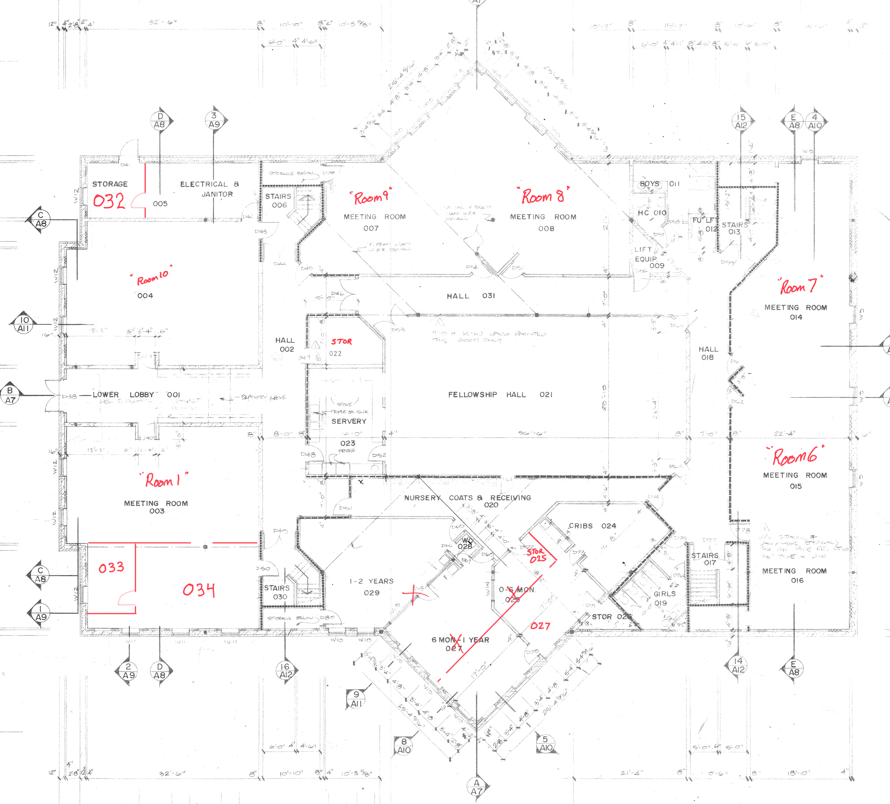
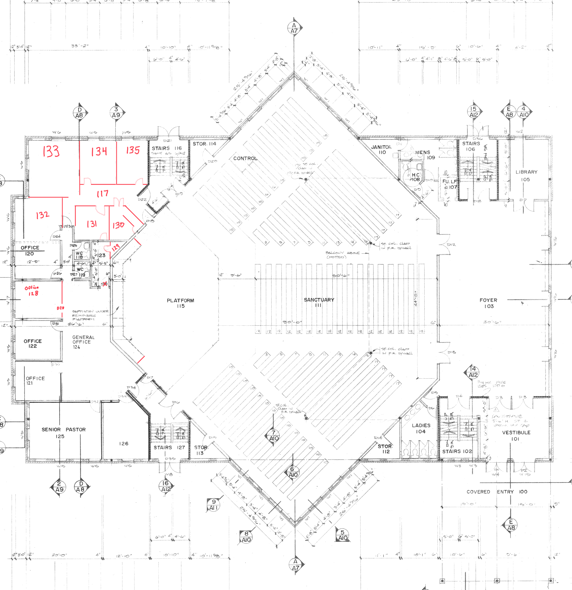
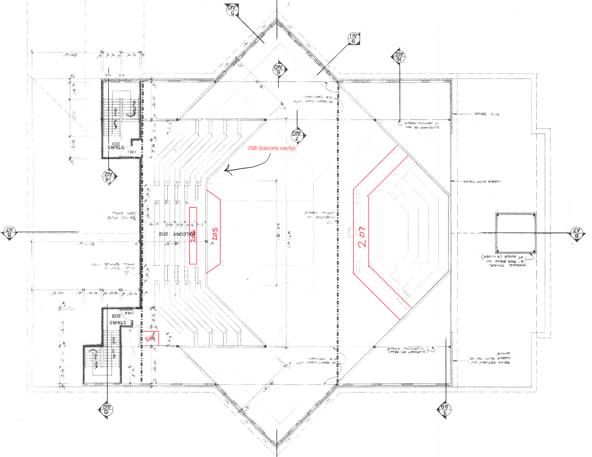

```{r packages_functions }
source('commonPackages.R')
source('commonFunctions.R')
source('commonDiagram.R')
```

```{r get_data}
rooms     <- get.rooms()
inventory <- get.inventory()  
```

```{r functions}

list.rooms <- function(building, floor) {
b <- building
f <- floor
	
	rooms |>
	filter(building == b) |>
	filter(floor    == f ) |> 
	arrange(room) |>
	select(room, common_name,	description,	usage ) |>
	gt() |>
	tab_header(glue("Room Directory for {b} building, floor {f}")) |>
	opt_stylize(style=3) |>
	cols_label(room = "Room#"
			  , common_name = "Name"
			  , description="Description"
			  , usage = "Usage")
}

asset.list <- function(b, f) {
	rooms |>
	filter(building == b, floor == f) |>
	inner_join(inventory, by=join_by(  building == Building
									 , floor    == Floor
									 , room     == Room
									 )) |>
	arrange(room, Location, AssetTag)  |>
	mutate(room_text = glue("Room: {common_name} Floor Plan #{room}" ) ) |>
	select(room_text, Location, AssetTag, Category, Manufacturer, Model, Type ) |>
	gt(groupname_col = c("room_text")) |>
	opt_stylize(style=3) |>
	tab_header(glue("Building {b}, Floor {f} - Assets by Room"))
}

```

# Introduction

# Main Builing

# Basement "Floor 0"



```{r room_list_main_0}
list.rooms("Main", "0")
```

```{r assets_main_0}
asset.list("Main", "0") 
```


# Basement "Floor 1"



```{r room_list_main_1}
list.rooms("Main", "1")
```

```{r assets_main_1}
asset.list("Main", "1") 
```
  
# Basement "Floor 2"



```{r room_list_main_2}
list.rooms("Main", "2")
```  

```{r assets_main_2}
asset.list("Main", "2") 
```

# Basement "Floor 3" The Attic

There are no room dividers in the attic, so we have just divided it up into an imaginary grid.


```{r room_list_main_3}
list.rooms("Main", "3")
```
# Portable "Floor 1"
 

 
```{r room_list_portble_1}
list.rooms("Portable", "1")
```

```{r assets_port_1}
asset.list("Portable", "1") 
```
 